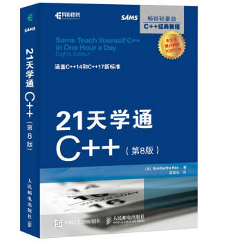
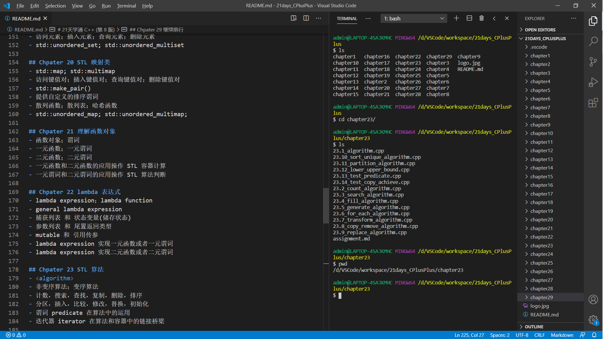

# 21天学通 C++ (第 8 版)



----------------------------------------

## Chpater 1 绪论
- 理解 C++ ，编译，链接
- 所有源代码均使用 GCC (g++) 编译
- 编辑器使用 Visual Studio Code (VSCode)
- 使用终端 Git Bash
- [VSCode](https://code.visualstudio.com/)
- [MinGW](https://sourceforge.net/projects/mingw-w64/files/)
- [Git for Windows](http://npm.taobao.org/mirrors/git-for-windows/)

```bash
$ gcc --version
gcc.exe (x86_64-posix-seh-rev0, Built by MinGW-W64 project) 8.1.0

$ g++ --version
g++.exe (x86_64-posix-seh-rev0, Built by MinGW-W64 project) 8.1.0

# Windows OS
download MinGW
download Git bash for Windows

# Linux OS based Debian & Ubtuntu
$ sudo apt update
$ sudo apt install build-essential

# Linux OS based CentOS & RedHat
$ sudo yum group install "Development Tools"

# Linux OS based Manjaro & Arch
sudo pacman -Sy gcc
```



## Chpater 2 C++程序的组成部分
- 基本的 C++ 程序框架
- 命名空间，注释，函数，标准输入输出

## Chpater 3 使用变量和常量
- 变量，内存，寻址，变量作用域，命名约定
- 常用 C++ 变量类型，溢出错误
- sizeof, auto, typedef
- 常量，const，constexpr，#define

## Chpater 4 管理数组和字符串
- 静态数组，多维数组，动态数组 std::vector
- C 语言风格字符串，C++ 字符串 std::string

## Chpater 5 使用表达式、语句和运算符
- 语句、语句块、运算符
- 算术运算符、逻辑运算符、位运算符、移位运算符
- 关系运算符、复合赋值运算符、运算符优先级

## Chpater 6 控制程序流程
- 分支条件控制 if-else、switch-case
- 循环控制 for、while、do-while、range-for
- 嵌套结构
- continue、break

## Chpater 7 使用函数组织代码
- 函数原型、定义、调用
- 形参、实参、参数传递
- 函数重载、数组（指针）传参、引用传参
- inline 函数、lambda 函数、auto 自动推导返回类型

## Chpater 8 阐述指针和引用
- 指针(内存地址)、地址引用运算符 & 、解引用运算发 * 
- new 和 delete
- 指针使用规范
- 引用(变量别名)
- const 用于指针和引用
- 函数参数传递中使用指针和引用

## Chpater 9 类和对象
- 类的声明和实现、类的实例(对象)
- 句点运算符访问成员 . ；指针运算符访问成员 -> == (*OBJ).
- 访问权限 public and private
- 构造函数、析构函数、拷贝构造函数、移动构造函数、this 指针
- 结构体、共用体、友元函数和友元类、聚合初始化、列表初始化
- 利用构造函数和析构函数进行模式设计

## Chpater 10 实现继承
- 继承和派生
- 访问限定符 public、protected、private
- 基类初始化、覆盖、隐藏
- 构造和析构顺序
- 切除行为、多继承、final

## Chpater 11 多态
- 多态行为、虚函数实现多态、虚函数工作原理——虚函数表 VFT
- 抽象基类、纯虚函数
- 利用纯虚函数解决菱形问题的二义性
- override、final、virtual
- 虚拷贝构造函数 ？？？

## Chpater 12 运算符类型与运算符重载
- 单目运算符、双目运算符、运算符重载
- 转换运算符、下标运算符、函数运算符
- 高性能编程之移动构造函数和移动赋值运算符
- 用户自定义字面值常量
- 不能重载的运算符

## Chpater 13 类型转换运算符
- 类型转换
- C++ 类型转换；C 风格类型转换
- static_cast; dynamic_cast
- reinterpret_cast; const_cast
- C++ 类型转换存在的问题

## Chpater 14 宏和模板简介
- 预处理器；预处理指令
- #define 定义常量和宏函数
- assert 验证宏表达式
- 模板函数; 模板类
- 模板实例化和具体化
- 可变参数数量的模板
- static_assert 执行编译阶段检查

## Chpater 15 标准模板库简介
- 标准模板库 STL Standard Template Library
- 容器 Container; 算法 Algorithm; 迭代器 Iterator
- 选择正确的容器
- STL 提供的字符串类

## Chpater 16 STL string 类
- STL string 类以及其具体化
- std::string; std::wstring
- 访问、拼接、查找、截短、反转和大小写转换操作

## Chpater 17 STL 动态数组类
- std::vector; std::deque
- push_back; pop_back
- push_front; pop_front
- size() and capacity()
- 数组方式访问：下标运算符
- 指针方式访问：迭代器

## Chpater 18 STL list 和 forward_list
- std::list; std::forward_list
- 插入元素；删除元素；
- reverse; sort
- 二元谓词进行按需排序

## Chpater 19 STL 集合类
- std::set; std::multiset 
- 访问元素；插入元素；查询元素；删除元素
- std::unordered_set; std::unordered_multiset

## Chpater 20 STL 映射类
- std::map; std::multimap
- 访问键值对；插入键值对；查询键值对；删除键值对
- std::make_pair()
- 提供自定义的排序谓词
- 散列函数；散列表；哈希函数
- std::unordered_map; std::unordered_multimap;

## Chpater 21 理解函数对象
- 函数对象；谓词
- 一元函数；一元谓词
- 二元函数；二元谓词
- 一元函数和二元函数的应用操作 STL 容器计算
- 一元谓词和二元谓词的应用操作 STL 算法判断

## Chpater 22 lambda 表达式
- lambda expression；lambda function
- general lambda expression
- 捕获列表 和 状态变量(储存状态)
- 参数列表 和 尾置返回类型
- mutable 和 引用传参
- lambda expression 实现一元函数或者一元谓词
- lambda expression 实现二元函数或者二元谓词

## Chpater 23 STL 算法
- <algorithm>
- 非变序算法；变序算法
- 计数，搜索，查找，复制，删除，排序
- 分区，插入，比较，修改，替换，初始化
- 谓词 predicate 在算法中的运用
- 迭代器 iterator 在算法和容器中的链接桥梁

## Chpater 24 自适应容器：栈和队列
- 自适应容器 adaptive container
- std::stack; std::queue; std::priority_queue
- push; pop; top; size; empty; back; front; 等成员函数以及操作
 
## Chpater 25 使用 STL 位标志
- std::bitset; std::vector<bool>
- std::bitset 的成员函数以及运算符
- std::vector<bool> 的成员函数以及运算符

## Chpater 26 理解智能指针
- 智能指针；原始指针(常规指针)
- 智能指针的实现机理
- 智能指针的类型(内存资源管理策略)
- 深拷贝；COW；引用计数；引用链接；破坏性复制
- C++11 std::unique_ptr
- 智能指针库 [Boost](https://www.boost.org/)

## Chpater 27 使用流进行输入和输出
- C++ 流类和流控制符
- 标准输入输出流 std::cout; std::cin; 以及流控制符
- 文件输入输出流 std::ifstream; std::ofstream; 以及文件操作
- 文本模式；二进制模式
- std::stringstream 字符串转换

## Chpater 28 异常处理
- 异常以及引起异常的因素
- try-throw-catch block
- 捕获特定异常类型
- std::exception base class
- 自定义异常类型

## Chpater 29 继续前行
- CPU 性能的提升
- 多核多线程
- 多线程编程
- 线程以及其通信
- 多线程技术
- 杰出 C++ 代码
- 现代 C++ (C++11/C++14/C++17/C++20/C++23) [C++ standard](https://isocpp.org/std/status)

## 附录 A 二进制和十六进制
## 附录 B C++ 关键字
## 附录 C 运算符优先级
## 附录 D ASCII 码

----------------------------------------

## About Author

### 掌中星辰转日月，手心苍穹天外天。
&emsp;&emsp;&emsp;&emsp;&emsp;&emsp;&emsp;&emsp;&emsp;&emsp;&emsp;&emsp;&emsp;&emsp;&emsp;&emsp;&emsp;&emsp;——云主宰苍穹

### Stay Hungry, Stay Foolish.
&emsp;&emsp;&emsp;&emsp;&emsp;&emsp;&emsp;&emsp;&emsp;&emsp;&emsp;&emsp;&emsp;&emsp;&emsp;&emsp;&emsp;&emsp;——Steve Jobs

------------------------------

- QQ Mail：2694048168@qq.com
- QQ：2694048168
- Weibo：云主宰苍穹
- GitHub: https://github.com/2694048168/
- Gitee：https://gitee.com/weili_yzzcq/
- Blog：https://2694048168.github.io/
- Blog：https://weili_yzzcq.gitee.io/ 
- Blog：https://blog.csdn.net/weixin_46782218/

-------------------------------------------