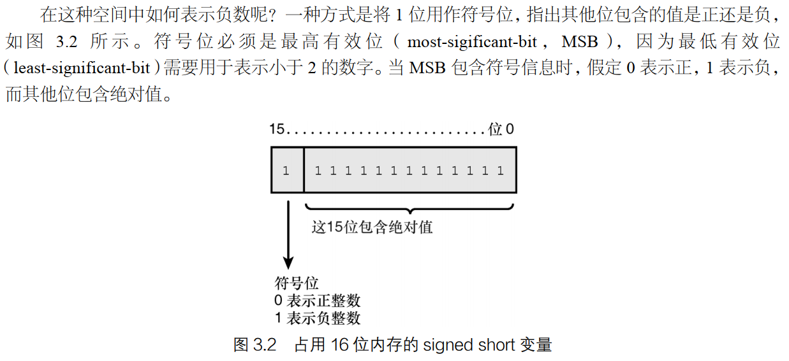

## Assignment 作业
- 作业包括测验和练习，前者帮助读者加深对所学知识的理解，后者提供了使用新学知识的机会。
- 请尽量先完成测验和练习题，继续学习下一章前，请务必弄懂这些答案。

### 3.10.1 测验
1. 有符号整型和无符号整型有何不同？
- 有符号整型变量的最高有效位 MSB 最为符号位，指出整数值是正或者负
- 无符号整型变量只能储存正整数




2. 为何不应使用#define 来声明常量？
- #define 是预处理编译指令，编译器对定义的值进行文本替换
- 不是一种安全的类型，是 C 语言中原始的常量定义方式


3. 为何要对变量进行初始化？
- 避免编译器随机初始化一些随机值，程序不可预测


4. 给定如下枚举类型， Queen 的值是多少？
```C++
enum YourCards {Ace, Jack, Queen, King};
```
- 枚举默认从 0 开始逐一赋值 


5. 下述变量名有何问题？
```C++
int Integer = 0;
```
- 语法没有问题，就是不能很好的见名知意，并且重复指出变量类型
- 不利于程序的理解和维护

### 3.10.2 练习
1. 修改测验题 4 中的枚举类型 YourCards，让 Queen 的值为 45。
```C++
enum YourCards 
{
  Ace = 43, 
  Jack, 
  Queen, 
  King
};

```

2. 编写一个程序，证明 unsigned int 和 int 变量的长度相同，且它们都比 long 变量短。
- 参考文件 3.9_test_size.cpp
```C++
#include <iostream>

int main(int argc, char**argv)
{
  std::cout << "size of int : " << sizeof(int) << std::endl;
  std::cout << "size of unsigned int : " << sizeof(unsigned int) << std::endl;
  std::cout << "**********************" << std::endl;
  std::cout << "size of unsigned long long : " << sizeof(unsigned long long) << std::endl;
  std::cout << "size of long long : " << sizeof(long long) << std::endl;
  std::cout << "size of long : " << sizeof(long) << std::endl;
  

  std::cout << "The output changes with compiler, hardware and OS." << std::endl;

  return 0;
}

// $ g++ -o main 3.9_test_size.cpp
// $ ./main
// size of int : 4
// size of unsigned int : 4
// **********************
// size of unsigned long long : 8
// size of long long : 8
// size of long : 4
// The output changes with compiler, hardware and OS.
```

3. 编写一个程序，让用户输入圆的半径，并计算其面积和周长。
- 参考文件 3.10_test_compute_circle.cpp
```C++
#include <iostream>

// constexpr float GetArea() { return PI * radius * radius; }
// constexpr float GetPerimeter() { return 2 * PI * radius; }

int main(int argc, char**argv)
{
  std::cout << "Enter the radius of the circle: ";
  float radius = 0.0;
  std::cin >> radius;

  const float PI = 3.1415926;

  // constexpr float GetArea() { return PI * radius * radius; }
  // constexpr float GetPerimeter() { return 2 * PI * radius; }
  // 不能这样用，常量表达式，必须是可以一次性计算的常量表达式，不能包含变量。

  float getArea = PI * radius * radius;
  float getPerimeter = 2 * PI * radius;

  std::cout << "The area of this circle is: " << getArea << std::endl;
  std::cout << "The perimeter of this circle is: " << getPerimeter << std::endl;

  return 0;
}

// $ g++ -o mian 3.10_test_compute_circle.cpp 
// $ ./mian.exe 
// Enter the radius of the circle: 6
// The area of this circle is: 113.097     
// The perimeter of this circle is: 37.6991
```

4. 在练习 3 中，如果将面积和圆周存储在 int 变量中，输出将有何不同？
- 精度损失，参考文件 3.10_test_compute_circle.cpp
```C++
#include <iostream>

// constexpr float GetArea() { return PI * radius * radius; }
// constexpr float GetPerimeter() { return 2 * PI * radius; }

int main(int argc, char**argv)
{
  std::cout << "Enter the radius of the circle: ";
  float radius = 0.0;
  std::cin >> radius;

  const float PI = 3.1415926;

  // constexpr float GetArea() { return PI * radius * radius; }
  // constexpr float GetPerimeter() { return 2 * PI * radius; }
  // 不能这样用，常量表达式，必须是可以一次性计算的常量表达式，不能包含变量。

  // float getArea = PI * radius * radius;
  int getArea = PI * radius * radius;
  // float getPerimeter = 2 * PI * radius;
  int getPerimeter = 2 * PI * radius;

  std::cout << "The area of this circle is: " << getArea << std::endl;
  std::cout << "The perimeter of this circle is: " << getPerimeter << std::endl;

  return 0;
}

// $ g++ -o mian 3.10_test_compute_circle.cpp 
// $ ./mian.exe 
// Enter the radius of the circle: 6
// The area of this circle is: 113.097     
// The perimeter of this circle is: 37.6991

// $ g++ -o mian 3.10_test_compute_circle.cpp 
// $ ./mian.exe 
// Enter the radius of the circle: 6
// The area of this circle is: 113    
// The perimeter of this circle is: 37
```

5. 查错：下面的语句有何错误？
```C++
auto Integer;
```
- auto 推断变量类型一定需要对变量进行初始化

```C++
auto iNumber = 0;
```