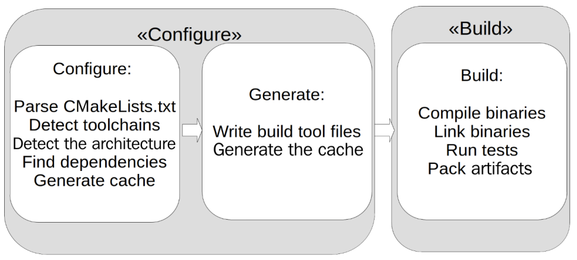
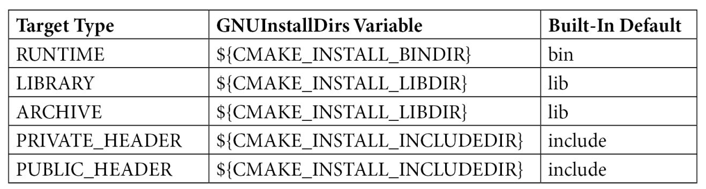
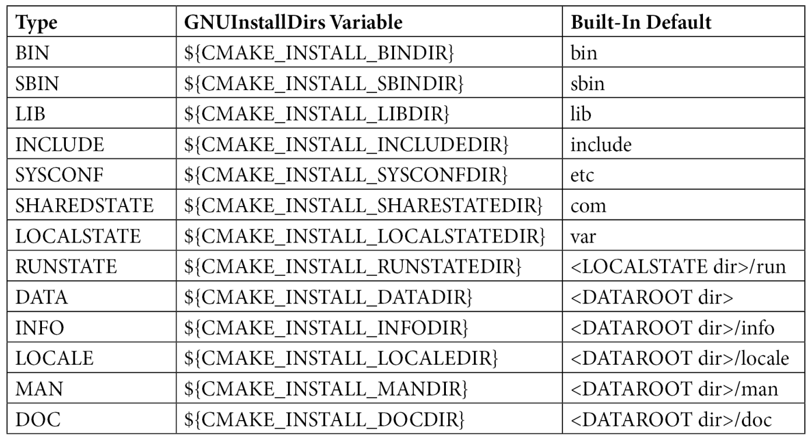
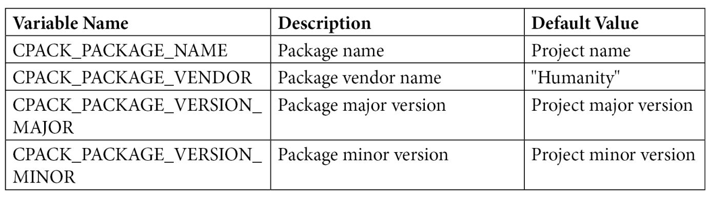
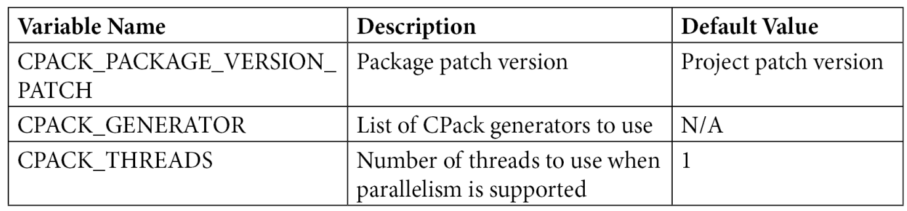
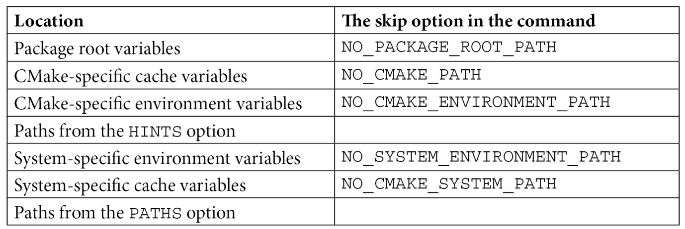
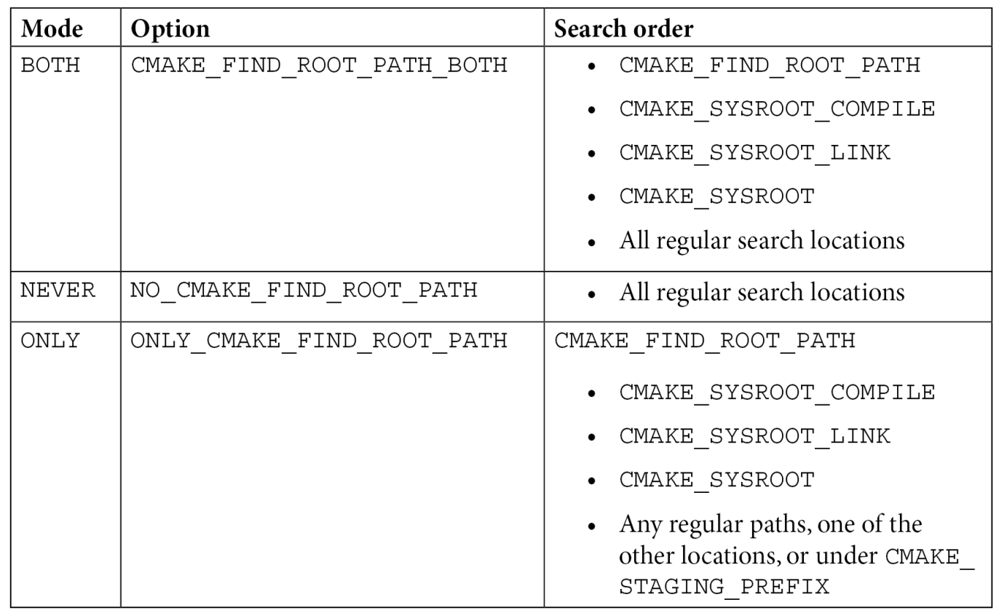

## CMake Best Practices

> Discover proven techniques for creating and maintaining programming projects with CMake

### CMake Command
```shell
cmake --version
cmake --help
cmake -S . -B build
cmake --build build
cmake -S . -B build -G Ninja
cmake -G

cmake -G "Unix Makefiles" -DCMAKE_BUILD_TYPE:STRING=Release -S . -B ./build
cmake -G "Ninja" -DCMAKE_BUILD_TYPE:STRING=Debug -S . -B ./build
cmake -G "Ninja" -DCMAKE_CXX_FLAGS:STRING="-Wall -Werror" -S . -B ./build

# see a list of available presets
run cmake --list-presets
# To build using a preset, run 
cmake --build --preset_name

# Listing cached variables
cmake -L ./build
# show the advanced variables and help strings associated with each variable
cmake -LAH ./build

# Building in parallel job_count
cmake --build ./build --parallel 8
cmake --build ./build/ --parallel $(($(nproc)-1))

# Building specific target(s)
cmake --build ./build/ --target "_framework_component1" --target "_framework_component2"

# Removing previous build artifacts before the build
cmake --build build --clean-first

# verbose mode to investigate nasty compilation and linkage errors with ease
cmake --build build --clean-first --verbose
cmake --build build --clean-first --verbose --

# additional **--prefix** parameter to change the installation directory
cmake --install build --prefix D:/DevelopTools
cmake --install build --prefix /home/weili/DevelopTools
cmake --install build --strip
cmake --install build --component component_name

# for multiple-configuration generators only, such as Visual Studio
cmake --install build --config Debug
cmake --install build --config Release

# install target into specific path, 
# and find_package via cmake folder config files
cmake --install .\build\ --prefix ..\consume_cmake\external

# Creating an installable package with CPack
cpack --config build/CPackConfig.cmake -B build/

#< lists all available modules
cmake --help-module-list

#< prints the documentation for module <mod>
cmake --help-module <mod> 

#< lists all modules and their documentation
cmake --help-modules 

cpack --config  build/CPackConfig.cmake -B build/pak

# generate dependency graphs
cmake --graphviz=graphviz/project.dot build/
dot -Tpng graphviz/project.dot -o graphviz/project.png

```

### Reference
- [**CMake Best Practices**](https://github.com/2694048168/C-and-C-plus-plus/tree/master/CMakePractics)
- [CMake Download](https://cmake.org/download/)
- [Ninja Download](https://ninja-build.org/)
- [Git Download](https://www.git-scm.com/downloads)
- [VSCode Download](https://code.visualstudio.com/Download)
- [CMake Tool extension for VSCode](https://marketplace.visualstudio.com/items?itemName=ms-vscode.cmake-tools)
- [Conan package management](https://conan.io/downloads)
- [Conan library](https://conan.io/center)
- [Conan docs](https://docs.conan.io/2/)
- [Vcpkg package management](https://github.com/microsoft/vcpkg)
- [Vcpkg package management](https://vcpkg.io/en/)
- [Vcpkg library](https://vcpkg.io/en/packages)
- [Doxygen download](https://doxygen.nl/download.html)
- [PlantUML download](https://plantuml.com/zh/download)
- [Graphviz download](https://graphviz.org/download/)


### Features
- **an industry standard** to building C++ applications
- **software engineers first** and more practical than theoretical
- install **latest stable** CMake and system **generator**
- **command line** and GUI and integrates with IDEs
- CMake project with **executable and library** and link together
- Packaging Deploying and Installing with **CPack(CMake's packaging program)**
- integrating **Third-Party libraries and Dependency** management
- Automatically generating Documentation with doxygen, dot (graphviz) and plantuml
- Integrating Code-Quality Tools(**unit testing**, code sanitizers, static code analysis, and code coverage tools)
- Custom Tasks, configuration the platform-agnostic commands
- Reproducible Build Environments(**CI/CD pipelines**)
- Big Projects and Distributed Repositories(**git**)
- Cross-Platform Compiling and Custom **Toolchains**
- CMake modules and generalize **CMake files**

### 00_Kickstarting_CMake
- an industry standard and build system generator
- support build systems such as Makefile, Ninja, Visual Studio, Qt Creator, Android Studio and Xcode.
- support installing, packaging, and testing software
- CMake language to configure build processes
- CMake consists command-line tools: cmake + ctest + cpack, and interactive tools: cmake-gui + ccmake
- CMake integrates package managers such as Conan and vcpkg

- **single-configuration** and multi-configuration generators
- **CMakeCache.txt** file where all the detected configurations are stored
- Each folder containing a **CMakeLists.txt** file will be mapped and a subfolder called **CMakeFiles** will be created, which contains the information that's used by CMake for building
- overview of the **core concepts** and **[language features](https://cmake.org/cmake/help/latest/manual/cmake-language.7.html)**
- Cmake language is simple and supports **variables**, string functions, **macros**, function definitions, and **importing other CMake files**
- Cmake syntax is based on **keywords** and **whitespace-separated** arguments
- The **PUBLIC** and **PRIVATE** keywords denote the visibility of the files when they're linked against this library and serve as delimiters between the lists of files
- CMake language supports **"generator expressions"**, which are evaluated during build system generation
- [CMake predefined variables prefixed with CMAKE_](https://cmake.org/cmake/help/latest/manual/cmake-variables.7.html)
- [CMake Properties](https://cmake.org/cmake/help/latest/manual/cmake-properties.7.html)
- [CMake Generate Expressions](https://cmake.org/cmake/help/latest/manual/cmake-generator-expressions.7.html) think of generator expressions as small inline if-statements
- [CMake presets](https://cmake.org/cmake/help/latest/manual/cmake-presets.7.html), **CMakePresets.json** files, which are placed in the root directory of a project
- each user can superimpose their configuration with a **CMakeUserPresets.json** file

### 01_Accessing_CMake_Best_Ways
- Configuring, Building, and Installing the CMake projects
- to interact with CMake projects via **command-line interface (CLI)**
- cmake version <maj.min.rev>
- cmake -G "Unix Makefiles" -S <project_root> -B <output_directory>
- To supply additional variables, the variable must be prefixed with -D
- cmake -G "Unix Makefiles" -DCMAKE_BUILD_TYPE:STRING=Release -S . -B ./build

> NOTE: The CMAKE_BUILD_TYPE variable only makes sense for single-configuration generators, such as Unix Makefiles and Ninja. In multiple-configuration generators, such as Visual Studio, the build type is a build-time parameter instead of a configuration-time parameter, thus, it cannot be configured by using the CMAKE_BUILD_TYPE parameter. 

- cmake -G "Ninja" -DCMAKE_BUILD_TYPE:STRING=Debug -S . -B ./build
- compilers used per-language via the **CMAKE_<LANG>_COMPILER** variables
- CMAKE_C_COMPILER || CMAKE_CXX_COMPILER || CMAKE_CUDA_COMPILER
- Compiler flags are similarly controlled by the **CMAKE_<LANG>_FLAGS** variable
- GCC or Clang enable all warnings and treat them as an error with -Wall and -Werror compiler flags
- cmake -G "Ninja" -DCMAKE_CXX_FLAGS:STRING="-Wall -Werror" -S . -B ./build
- Build flags can be customized for a per-build type by suffixing them with capitalized build type string
- **CMAKE_<LANG>_FLAGS_DEBUG** | **CMAKE_<LANG>_FLAGS_RELEASE** | CMAKE_<LANG>_FLAGS_RELWITHDEBINFO | CMAKE_<LANG>_FLAGS_MINSIZEREL
- cmake -G "Unix Makefiles" -DCMAKE_CXX_FLAGS:STRING="-Wall -Werror" -DCMAKE_CXX_FLAGS_RELEASE:STRING="-O3" -DCMAKE_BUILD_TYPE:STRING= "Release" -S . -B ./build
- The benefit of using **cmake --build** via invoking build system-specific commands helpful when building CI pipelines or build scripts
- Building in parallel append **--parallel <job_count>** to cmake --build command

> one job per hardware thread, In multi-core systems, it is also recommended to use at least one less than the available hardware thread count to not affect the system's responsivity during the build process. You can usually use more than one job per hardware thread and get faster build times since the build process is mostly I/O bound, but your mileage may vary. 

- cmake --build ./build/ --parallel $(($(nproc)-1))
- Building specific target(s) only via **--target** sub-option with multiple times
- Removing previous build artifacts before the build via **--clean-first** sub-option
- Debugging your build process via **--verbose** sub-command instructs CMake to invoke all build commands with verbose mode to investigate nasty compilation and linkage errors with ease

- Passing command-line arguments to the build tool via **--**, such **--trace** to make build tool
- CMake code must be already using CMake **install()** instructions to specify what to install when **cmake --install** (or the build system equivalent) is invoked
- default installation directory varies between environments, For Unix-like environments, it defaults to **/usr/local**, whereas in a Windows environment, it defaults to **C:/Program Files**
- additional **--prefix** parameter to change the installation directory
- cmake --install build --prefix /tmp/example
- CMake's --install command allows the stripping of binaries while installing the operation via **--strip**
- Installing specific components only (component-based install) via **--component** argument
- Installing a specific configuration (for multiple-configuration generators only), such as Visual Studio
- cmake --install build --config Debug/Release 
- Our motto here is, Being **explicit** is almost always better than being **implicit** 
- ccmake (CMake curses GUI) and cmake-gui is a terminal-based graphical user interface (GUI) for CMake
- ccmake -G "Unix Makefiles" -S . -B ./build
- Using CMake in Visual Studio, Visual Studio Code, and Qt Creator
- Passing arguments to the debugged target[VSCode's settings.json]
- always define additional kits by adding them to the user-local **cmake-tools-kits.json** file manually

### 02_Creating_CMake_Project
- **build**: The folder where the build files and binaries are placed
- **include/project_name**: This folder contains all the header files that are publicly accessible from outside the project. Adding a subfolder that contains the project's name is helpful since includes are done with <project_name/some_file.h>, making it easier to figure out which library a header file is coming from.
- **src**: This folder contains all the source and header files that are private
- **CMakeLists.txt**: This is the root CMake file

```
./project_name
├── CMakeLists.txt
├── build
├── docs
├── test
├── external or 3thParty
├── include/project_name
└── src
└── sub_project
    ├── CMakeLists.txt
    ├── include
    │   └── sub_project
    └── src
```

- [the available compile features](https://cmake.org/cmake/help/latest/prop_gbl/CMAKE_CXX_KNOWN_FEATURES.html)
- **PUBLIC**, **PRIVATE**, **INTERFACE** for source and header files

> Naming libraries, using add_library(<name>), the platform, such as lib<name>.so on Linux and <name>.lib or <name>.dll on Windows.  the prefix or postfix of lib as CMake may append or prepend the appropriate string to the filename, depending on the platform.

- Symbol(classes, functions, types, and more) visibility in shared libraries
- Compilers have different ways and default behavior when specifying symbol visibility

> the default visibility of the compilers; gcc and clang assume that all the symbols are visible, while Visual Studio compilers, by default, hide all the symbols unless they're explicitly exported. By setting "CMAKE_WINDOWS_EXPORT_ALL_SYMBOLS", the default behavior of MSVC can be changed.

- Changing the default visibility via "<LANG>_VISIBILITY_PRESET" property to HIDDEN
- CMake provides **generate_export_header** macro, which is imported by the **GenerateExportHeader** module
- sets the "VISIBILITY_INLINES_HIDDEN" property to TRUE to further reduce the export symbol table by hiding  inlined class member functions

> It is good practice to put these generated files in a subfolder of the build directory so that only part of the directory is added to the include path. The include structure of the generated files should match the include structure of the rest of the library.

- [Additional information about setting symbol visibility via CMake](https://cmake.org/cmake/help/latest/module/GenerateExportHeader.html)
- Interface or header-only libraries via  **add_library(MyLibrary INTERFACE)**
- Object libraries – for internal use only via  **add_library(MyLibrary OBJECT)**
- Setting compiler and linker options via **target_compile_options** and **target_link_options**

> GCC and Clang, options are passed with a dash (-), while the Microsoft compiler takes slashes (/) as prefixes for its options. But by using generator expressions. Generator expressions are evaluated during build system generation, the inner expression evaluates to true and someOption is passed to the compiler. Passing compiler or linker options as PRIVATE marks them as a build requirement for this target that is not needed for interfacing the library. if PRIVATE is substituted with PUBLIC, then the compile option also becomes a usage  requirement and all the targets that depend on the original targets will use the  same compiler options. Exposing compiler options to the dependent targets is  something that needs to be done with caution. If a compiler option is only needed to use a target but not to build it, then keyword INTERFACE can be used. This is mostly the case when you're building header-only libraries. 

```CMake
target_compile_options(
  target_name
  PRIVATE $<$<CXX_COMPILER_ID:MSVC>:/SomeOption>
          $<$<CXX_COMPILER_ID:GNU,Clang,AppleClang>:-someOption>
)
```

- A special case of compiler options is compile definitions, which are passed to the underlying program. These are passed with the **target_compile_definitions** function
- Debugging compiler options via **CMAKE_EXPORT_COMPILE_COMMANDS** variable to generate [**compile_commands.json**](https://clang.llvm.org/docs/JSONCompilationDatabase.html) for VSCode or CLion
- Library aliases(MyProject::Library) for common targets libraries named utils, helpers, and similar

```CMake
add_library(Namespace::utils ALIAS utils)
add_library(Namespace::utils ALIAS helpers)

target_link_libraries(SomeLibrary PRIVATE Namespace::utils)
target_link_libraries(SomeLibrary PRIVATE Namespace::helpers)
```

> As a good practice, always ALIAS your targets with a namespace and reference them using the namespace:: prefix.

### 03_Packaging_Deploying_Installing
- Building a software project is only half the story. The other half is about delivering and presenting the software to your consumers
- Remember, happy consumers will bring value to a product
- Making CMake targets installable via **install()** command that allows you to generate build system instructions for installing targets, files, directories, and more
- The **TARGETS** parameter denotes that install will accept a set of CMake targets to generate the installation code for.
- **signature**: install(TARGETS <target>... [...])
- The most common output artifacts for a target:
  - ARCHIVE (static libraries, DLL import libraries, and linker import files):
    - Except for targets marked as FRAMEWORK in macOS
  - LIBRARY (shared libraries):
    - Except for targets marked as FRAMEWORK in macOS
    - Except for DLLs (in Windows)  
  - RUNTIME (executables and DLLs):
    - Except for targets marked as MACOSX_BUNDLE in macOS
- The **GNUInstallDirs** module defines various **CMAKE_INSTALL_** paths when included default installation directories for the targets:



- To override the built-in defaults, an additional **<TARGET_TYPE> DESTINATION** parameter is required in the install(...) command
- Installing files and directories via **install(FILES...)** and **install(DIRECTORY...)** commands for installing any specific files or directories(images, assets, resource files, scripts, and configuration files)



> install(DIRECTORY...) the FILES_MATCHING parameter to define criteria for file selection. FILES_MATCHING can be followed by either the PATTERN or REGEX argument. PATTERN allows you to define a global pattern, whereas REGEX allows you to define a regular expression. install() command's first parameter indicates what to install. There are additional parameters that allow us to customize the installation. such "DESTINATION", "PERMISSIONS", "CONFIGURATIONS", "OPTIONAL".

- Supplying configuration information for others using your project via **find_package()** method
- Packages can be in the form of **Config-file** packages, Find-module packages, or pkg-config packages
- There are two types of configuration files: a package configuration file and an optional package version file
- Package configuration files can be named **<ProjectName>Config.cmake** or **<projectname>-config.cmake**
- Both notations will be picked by CMake on find_package(ProjectName)/find_package(projectname) calls
- **<ProjectName>ConfigVersion.cmake** or **<projectname>-config-version**
- find_package(...) looks while searching for packages is the **<CMAKE_PREFIX_PATH>/cmake** directory
- Creating an installable package with CPack to generate platform-specific installations and packages
- [available CPack generator types](https://cmake.org/cmake/help/latest/manual/cpack-generators.7.html)

| Generator Name | Description                  |
|----------------|------------------------------|
| 7Z             | 7-zip archive                |
| DEB            | Debian package               |
| External       | CPack external package       |
| IFW            | Qt Install Framework         |
| NSIS           | Null Soft Installer          |
| NSIS64         | Null Soft Installer(64-bit)  |
| NuGet          | NuGet packages               |
| RPM            | RPM packages                 |
| STGZ           | Self-extracting TAR gzip archive |
| TBZ2           | Tar BZip2 archive            |
| TGZ            | Tar GZip  archive            |
| TXZ            | Tar XZ    archive            |
| TZ             | Tar Compress archive         |
| TZST           | Tar Zstandard archive        |
| ZIP            | ZIP archive                  |

- CPack uses the configuration details that are present in the **CPackConfig.cmake** and **CPackSourceConfig.cmake** files to generate packages
- CPack module allows to customize the packaging process via a large amount of CPack variables




> NOTE: Any changes that must be made to the variables must be made before you include the CPack module. Otherwise, the defaults will be used.

```shell
cd CPack
cmake –S . -B build
ls build/CPack*

# for single-config generator
cmake --build build

# for multi-config generator
cmake --build build --config Release

cpack --config build/CPackConfig.cmake -B build/
```

### 04_Integrating_ThirdParty_Libraries_Dependency_Management
- The first how to **find** those things(**files, libraries, and programs**) in general, while the latter part how to **manage** dependencies
- how to write **instructions** for CMake to reliably find almost any library on your system
- use package managers such as **Conan** and **vcpkg** with CMake
- **Finding** files, programs, and paths with CMake
  - the search order of where to look for files
  - add additional locations where the file might be
  - account for the differences between different operating systems
- There are five **find_... commands** that share very similar options and behaviors:
  * [find_file](https://cmake.org/cmake/help/latest/command/find_file.html): This locates a single file
  * [find_path](https://cmake.org/cmake/help/latest/command/find_path.html): This finds a directory containing a specific file
  * [find_library](https://cmake.org/cmake/help/latest/command/find_library.html): This finds library files
  * [find_program](https://cmake.org/cmake/help/latest/command/find_program.html): This finds executable programs
  * [find_package](https://cmake.org/cmake/help/latest/command/find_package.html): This finds complete sets of packages



- Searching for files when **cross-compiling** via **CMAKE_SYSROOT**, **CMAKE_SYSROOT_COMPILE**, and **CMAKE_SYSROOT_LINK** variables affect the search locations
- By default CMake searches in the locations provided by any of the variables from the preceding paragraph and then continues to search the host system



> find_program command, On Windows, the .exe and .com file extensions are automatically added to the filenames provided, but not .bat or .cmd. 

- As with the other find commands, find_program will set **<varname>-NOTFOUND** variable if CMake is unable to find the program

> find_library, On Unix platforms, the names will be prefixed with lib, while on Windows, the.dll or .lib extensions will be added. CMake is generally aware of conventions regarding 32-bit and 64-bit search locations such as platforms using the lib32 and lib64 folders for different libraries of the same name.

- **Using** third-party libraries in your CMake project
  - Packages provide a set of information about dependencies for CMake and the generated build systems
  - find_package command the result is a set of imported targets and/or a set of variables containing information that is relevant to the build system
  - by their **configuration details** (also called config-file packages), which are provided by the upstream project
  - as so-called find **module packages**, which are usually defined somewhere that is unrelated to the package, either by CMake itself or by the project using the package

> The **findPkgConfig** module, which uses find-pkg to find the relevant meta-information for a dependency, also provides indirect support for packages. the find_package command has two signatures: a basic or short signature and a full or long signature. The short form supports both the module and config packages, but the long form only supports configuration mode. Assume regular package manager such as **apt**, RPM, or similar for Linux, **chocolatey** for Windows, or **brew** for macOS.

> NOTE: Unfortunately, as of version 3.21, CMake cannot query the modules for the available components. So, we have to rely on the documentation of the modules or library providers to find out which components are available. [cmake modules](https://cmake.org/cmake/help/latest/manual/cmake-modules.7.html)

```shell
#< lists all available modules
cmake --help-module-list

#< prints the documentation for module <mod>
cmake --help-module <mod> 

#< lists all modules and their documentation
cmake --help-modules 
```

> When run in module mode, the **find_package command** searches for files called **Find<PackageName>.cmake**; this occurs, first, in the paths specified by **CMAKE_MODULE_PATH** and then among the find modules provided by the CMake installation. When run in config mode, **find_package** searches for files called after either of the following patterns: 1. **<lowercasePackageName>-config.cmake**; 2. **<PackageName>Config.cmake**; 3. **<lowercasePackageName>-config-version.cmake** (if the version details were specified); 4. **<PackageName>ConfigVersion.cmake** (if the version details were specified). All searches will be conducted over a set of locations in a well-defined order; if needed, some of the locations can be skipped by passing the respective option to CMake. [cmake packages](https://cmake.org/cmake/help/latest/manual/cmake-packages.7.html)

- Writing your own find module
  - when invoking find_package in module mode, CMake searches for files called Find<PackageName>.cmake in **CMAKE_MODULE_PATH**

```shell  
├── dep <-- The folder where we locally keep dependencies
├── cmake
│   └── FindLibImagePipeline.cmake <-- This is what we need to write
├── CMakeLists.txt <-- Main CmakeLists.txt
├── src
│   ├── *.cpp files

#  add the cmake folder to the CMAKE_MODULE_PATH, which is a list
list(APPEND CMAKE_MODULE_PATH "${CMAKE_CURRENT_SOURCE_DIR}/cmake")
```  

- Using **package managers** with CMake
  - The easiest way to get dependencies is to install using **apt**, **brew**, or **Chocolatey**
  - C++ package managers **Conan** or **vcpkg**
  - check for the **Conan program** using **find_program** before using Conan2
  - vcpkg run in **manifest mode**, dependencies are defined in a **vcpkg.json** file in the root of the project

> If they are run in manifest mode, the packages specified in the vcpkg.json file will be automatically downloaded and installed locally. If they are run in classic mode, the packages have to be manually installed before running CMake. When passing the vcpkg toolchain file, the installed packages can be used, as usual, by using find_package and target_link_libraries. Setting the toolchain file might cause problems when cross-compiling, as CMAKE_TOOLCHAIN_FILE might point to a different file already. In this case, a second toolchain file can be passed with the VCPKG_CHAINLOAD_TOOLCHAIN_FILE variable.

```shell
cmake -S <source_dir> -D <binary_dir> -DCMAKE_TOOLCHAIN_FILE=[vcpkg root]/scripts/buildsystems/vcpkg.cmake

cmake -S <source_dir> -D <binary_dir> -DCMAKE_TOOLCHAIN_ FILE=[vcpkg root]/scripts/buildsystems/vcpkg.cmake -DVCPKG_CHAINLOAD_TOOLCHAIN_FILE=/path/to/other/toolchain.cmake
```

- Getting the **dependencies** as source code
- getting external content is the CMake **ExternalProject** and **FetchContent** module

> One of the main differences between ExternalProject and FetchContent is that **FetchContent** downloads and configures external projects during configuration time, while **ExternalProject** does everything during the build step. As ExternalProject, FetchContent can download from HTTP(S), Git, SVN, Mercurial, and CVS, and the same good practices, such as specifying MD5 hashes for the downloaded content or using Git hashes, apply. 

- **[Git submodules](https://www.git-scm.com/book/en/v2/Git-Tools-Submodules)** and using add_subdirectory
- [ExternalProject](https://cmake.org/cmake/help/latest/module/ExternalProject.html)

### 05_Auto_Generating_Docs
- integrating **Doxygen**, **DOT**, and **PlantUML** into CMake to speed up the documentation process
- Generating documentation from source code
  - Doxygen requires comments to be in a predefined set of formats
  - [Doxygen comment formats](https://www.doxygen.nl/manual/docblocks.html), Javadoc-style comments recommended
  - Doxygen also requires a **Doxyfile**, which CMake will generate
  - [Doxygen config](https://www.doxygen.nl/manual/config.html)
  - enabling PlantUML support in Doxygen
- Packaging and distributing documentation with CPack

```shell
cd 05_Auto_Generating_Docs/doxygen_doc/

cmake -S . -B build/
cmake --build build/ --config Release # for multi-config
cmake --build build/ # for single-config

cpack --config  build/CPackConfig.cmake -B build/pak

cmake --graphviz=graphviz/project.dot build/
dot -Tpng graphviz/project.dot -o graphviz/project.png
```

- Creating dependency graphs of CMake targets
  - need to document and **visualize** the CMake code via **--graphviz**
  - The **DOT language** is a description language for graphs
  - Behavior and options can be controlled by the **variables** provided in **CMakeGraphVizOptions**
  - [CMakeGraphVizOptions](https://cmake.org/cmake/help/latest/module/CMakeGraphVizOptions.html)

> DOT files can be converted to images or even Portable Document Format (PDF) files using the dot command-line utility from Graphviz, like this: **dot -Tpng filename.dot -o out.png**

