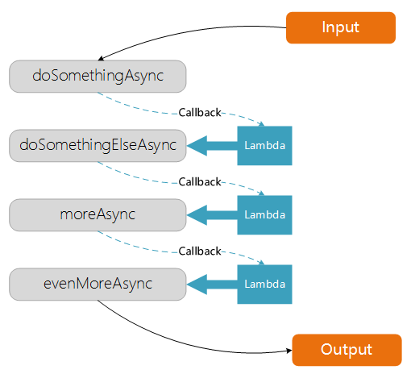
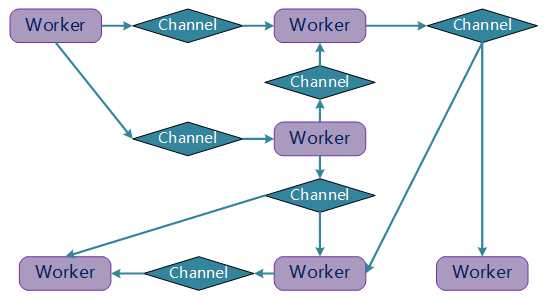

## 四种并发编程模型

> 并发和并行两个概念经常同时被提起, 需要明确一点**并发**并不等于**并行**; 并发, 指代同一时间对待多件事情(逻辑层面); 并行, 指代同一时间执行多件事件(物理层面). 并发可以构造出一种问题解决方法, 该方法能够被用于并行化, 从而让原本只能串行处理的业务并行化, 更好地发挥出当前多核CPU, 分布式集群的能力. 但是, 并发编程和人的思维方式是不一样的, 因此才有了各种编程模型的抽象方式构建并发程序.

### 多线程编程模型

多线程模型是用于处理并发的最通用手段, 在 C/C++ 中广泛存在. 主要特性有
- 多个相互独立的执行流
- 共享内存(状态)
- 抢占式的调度
- 依赖锁，信号量等同步机制

**多线程模型**
- Callback 编程模型
- Actor 编程模型
- CSP 编程模型

### Callback 编程模型

**回调**, 简单来说: 某个函数(func_A)可以接受另一个函数(func_B)作为参数, 在执行流程到某个点时作为参数的函数 func_B 就会被函数 func_A 调用执行, 这个行为就被称为回调. 现实中, 回调常常用于异步事件, 即函数 func_A 一般会在函数 func_B 没有被调用的情况下就先返回, 而在某个异步事件发生时再触发调用函数 func_B.

### Actor 编程模型

### CSP 编程模型

