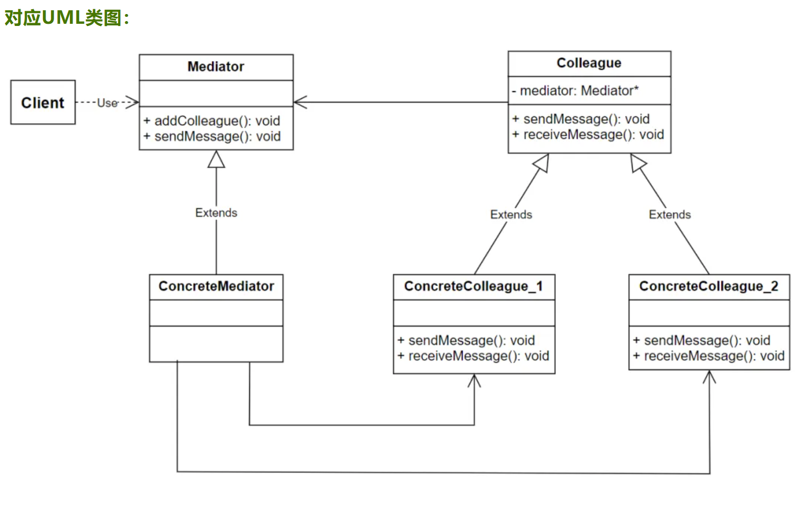

# 设计模式 Design Patterns

> **Design patterns** are typical solutions to common problems in software design. Each pattern is like a blueprint that you can customize to solve a particular design problem in your code.

> In software engineering, a **design pattern** is a general repeatable solution to a commonly occurring problem in software design. A design pattern isn't a finished design that can be transformed directly into code. It is a description or template for how to solve a problem that can be used in many different situations.

In software engineering, a **software design pattern** or **design pattern** is a general, reusable solution to a commonly occurring problem in many contexts in software design. A design pattern is not a rigid structure that can be transplanted directly into source code. Rather, it is a description or a template for solving a particular type of problem that can be deployed in many different situations. Design patterns can be viewed as formalized best practices that the programmer may use to solve common problems when designing a software application or system.

Object-oriented design patterns typically show relationships and interactions between classes or objects, without specifying the final application classes or objects that are involved. Patterns that imply mutable state may be unsuited for functional programming languages. Some patterns can be rendered unnecessary in languages that have built-in support for solving the problem they are trying to solve, and object-oriented patterns are not necessarily suitable for non-object-oriented languages.

Design patterns may be viewed as a structured approach to computer programming intermediate between the levels of a programming paradigm and a concrete algorithm.

## **设计模式**
- 创建型模式
    - 简单工厂模式 Simple Factory
    - 工厂方法模式 Factory Method
    - 抽象工厂模式 Abstract Factory
    - 创建者模式 Builder
    - 原型模式 Prototype
    - 单例模式 Singleton
- 结构型模式
    - [外观模式 Facade](Facade.cpp)
    - [适配器模式 Adapter](Adapter.cpp)
    - [代理模式 Proxy](Proxy.cpp)
    - [组合模式 Composite](Composite.cpp)
    - [享元模式 Flyweight](Flyweight.cpp)
    - [装饰模式 Decorator](Decorator.cpp)
    - [桥模式 Bridge](Bridge.cpp)
- 行为型模式
    - [中介者模式 Mediator](Mediator.cpp)
    - [观察者模式 Observer](Observers.cpp)
    - [观察者模式 Observer](ObserversClockTimer.cpp)
    - [观察者模式 Observer](ObserversWeather.cpp)
    - [命令模式 Command](Command.cpp)
    - [迭代器模式 Iterator](Iterator.cpp)
    - [模板方法模式 Template Method](TemplateMethod.cpp)
    - [策略模式 Strategy](StrategyUML.cpp)
    - [状态模式 State](State.cpp)
    - [备忘录模式 Memento](Memento.cpp)
    - [解释器模式 Interpreter](Interpreter.cpp)
    - [职责链模式 Chain of Responsibility](ChainResponsibility.cpp)
    - [访问者模式 Visitor](Visitor.cpp)

### 单例模式 [Singleton](https://refactoringguru.cn/design-patterns/singleton)

> 单例模式是一种创建型设计模式,能够保证一个类只有一个实例,并提供一个访问该实例的全局节点.

```C++
class Logger
{
public:
    static Logger& GetInstance()
    {
        static Logger logger;
        return &logger;
    }

private:
    Logger();
    Logger(const Logger&) = delete;
    Logger(Logger&&) = delete;
}
```

### 工厂模式 [Factory](https://refactoringguru.cn/design-patterns/factory-method)

> 工厂方法模式是一种创建型设计模式,其在父类中提供一个创建对象的方法,允许子类决定实例化对象的类型.

### Strategy 策略模式

> 定义一系列策略(算法), 并进行封装,可以相互转换, 使得策略(算法)可独立于客户程序. 策略模式是一种行为型设计模式, 策略模式在软件开发场景中定义了一系列的算法, 并将每个算法单独封装在可替换的对象中, 使应用程序在运行时可以根据具体的上下文来动态地选择和切换算法, 同时保持原有的代码架构不被修改. 策略模式的设计使得算法的实现与调用被分离, 让算法可以独立于外部客户端进行开发和改动, 使用独立的类来封装特定的算法, 也避免了不同算法策略之间的互相影响. 策略模式能适应多种应用场景, 为了满足业务需求, 应用程序在运行时可以选择不同的算法策略来达到最优的实现效果. 策略模式将不同的算法实现封装成独立的类, 使得算法的修改不会影响到客户端代码, 提高了应用程序的灵活性和可维护性; 策略模式的架构可以避免使用大量的if-else条件语句来大量判断不同的策略分支, 优化了代码结构, 增加了代码的可扩展性.

#### 策略模式的结构
- 策略上下文(Context):
    - Context类是策略模式的调度核心,其内部包含了一个策略对象,并通过调用具体的策略对象来完成具体操作;
    - Context类对外提供了与客户端交互的API接口, 并隐藏了具体的算法细节, Context类相当于一个中间件, 将算法封装与客户端调用进行了分离;
- 抽象策略类(Strategy):
    - Strategy类定义了一个公共接口,该公共接口最终将被具体的算法模块进行实现和重写;
- 具体策略类(ConcreteStrategy):
    - ConcreteStrategy类实现了Strategy类定义的公共接口;
    - 每一个具体策略类都包含特定的算法实现细节, 并用来处理特定的应用场景;
- 组件之间的工作步骤如下:
    1. 客户端根据业务需要选择一个具体策略类, 并初始化一个对应的策略对象
    2. 客户端将创建好的策略对象传递给策略上下文
    3. 策略上下文调用策略对象的接口函数
    4. 当客户端需要更换算法策略时, 可以重新选择一个具体策略类, 并传递一个新的策略对象给策略上下文


#### 策略模式的应用场景
- 文件格式处理: 代码可以根据不同的文件格式选择不同的解析策略, 例如文本格式、XML、JSON等
- 交易系统开发: 系统根据交易类型、支付渠道等，选择不同的处理策略
- 可配置应用开发: 用户可以根据不同的业务场景来动态选择不同的配置模板
- 通用API开发: 当同一个API需要提供多个版本或业务逻辑时, 策略模式可以帮助隐藏具体细节

#### 策略模式的优缺点
- 策略模式的优点:
    - 对"开闭原则"提供完美支持
    - 基于上下文和算法类的封装, 方便管理和调度一系列算法策略
    - 避免了if-else条件语句的大量使用
    - 支持灵活的替换算法策略, 代码的可读性和扩展性很强
    - 算法被封装以后, 可以独立地被多个客户端和上下文复用
- 策略模式的缺点:
    - 使类和对象的数量变得更多, 增加了系统的复杂性
    - 如果策略被划分得过于细化, 会导致过度设计, 不易于代码理解
    - 代码涉及多个对象的创建和销毁, 性能开销增大, 大量使用会引起性能问题


### Observer 观察者模式

> 定义对象间的一种一对多(变化的)的依赖关系, 当一个Object状态发生变化时, 所有依赖于其的对象都能得到通知并更新

- 观察者模式是一种行为型设计模式, 又被称为"发布-订阅"模式, 它定义了对象之间的一对多的依赖关系, 当一个对象的状态发生变化时, 所有依赖于它的对象都会收到通知并自动更新
- 观察者模式的关注点是对象之间的通信以及被观察对象的状态


**观察者模式在现实生活中的抽象实例**
- 报纸订阅: 报纸的内容发生变化时, 订阅了该报纸的读者们都会收到通知并阅读最新的内容
- 股票投资: 股票的价格发生波动时, 投资者们会根据最新价格修改相应的投资决策
- 天气预报: 当天气发生变化时, 订阅了该服务的用户们会收到通知
- 网络论坛: 当论坛中有新的帖子或回复出现时, 论坛的用户们会收到通知并可以参与讨论

#### 观察者模式的结构
- 被观察者(Subject): 
    - 被观察的对象,它的内部包含了观察者对象的集合, 并提供了添加、通知和删除观察者对象的统一接口
- 观察者(Observer):
    - 接收Subject通知的对象, 它订阅了Subject的状态, 并提供了更新操作的统一接口
- 具体的被观察者(ConcreteSubject):
    - 包含Subject类接口的具体实现, 维护了观察者的列表, 自身状态发生变化时通知所有的观察者
- 具体的观察者(ConcreteObserver):
    - 包含Observer类接口的具体实现, 提供了更新操作的具体实现细节, 一旦收到Subject的通知便进行更新操作

**组件之间的工作步骤如下**
- 被观察者维护一个观察者的列表, 并提供了管理和通知观察者的方法
- 观察者与被观察者绑定(attach), 并将自己添加到观察者列表中
- 当被观察者的状态发生变化时, 开始通知观察者, 通知的方式一般是遍历观察者列表, 遍历时会调用每个观察者的更新方法
- 观察者完成具体的更新操作


#### 观察者模式的应用场景
- 事件驱动编程: GUI界面开发时, 监听用户在界面的各种操作, 如按钮点击、窗口关闭等
- 监控服务开发: 当系统状态发生变化时(例如磁盘空间不足),工具会收到通知
- 消息队列开发: 基于"消费者-生产者"模式进行通信, 当消息队列中有新的消息时, 消费者会收到通知

**观察者模式的优缺点**
- 观察者模式的优点:
    - 符合"开闭原则"的要求
    - 支持广播的通信方式
    - 支持事件驱动编程
    - 可以动态添加观察者, 代码扩展性好
- 观察者模式的缺点:
    - 每次状态变化都要遍历所有观察者, 性能开销大
    - 每次状态变化都要通知所有的观察者, 通信时间变长
    - 观察者数量过多会使代码的可读性变差
    - 当有多个客户端操作观察者的删除时, 会带来数据安全问题


### Chain of Responsibility 职责链模式

> 多个对象(一条责任链)都有机会处理请求, 从而避免发送者和接受者之间的关系, 这这些对象连成一条链, 并沿着这条链进行传递请求, 直到有一个对象处理该请求为止. 职责链模式, 又被称为责任链模式,是一种行为型设计模式,它让多个对象依次处理收到的请求,直到处理完成为止; 职责链模式需要使用多个对象, 其中的每个对象要么处理请求, 要么将请求传递给下一个对象, 该模式因此可以实现发送方与接收方的松散耦合; 在职责链模式中, 一个对象可以被理解为处理器, 每个处理器都包含对下一个处理器的引用, 多个对象之间形成了一个链表的结构.


#### 职责链模式的结构
**职责链模式主要包含以下组件**:
- 抽象处理器(Handler):
    - 处理器的抽象类, 声明处理请求的抽象接口, 并持有对下一个处理器的引用
- 具体处理器(ConcreteHandler)：
    - 继承自抽象处理器,包含了对处理请求接口的具体实现,负责处理特定类型的请求或将请求传递给下一个处理器
- 客户端(Client):
    - 负责创建处理器的实例, 并将它们加入到职责链中
    - 然后向第一个处理器发送请求, 并等待职责链的返回结果

**组件之间的工作步骤如下**
- 客户端将请求传递给职责链中的第一个处理器
- 第一个处理器尝试处理请求; 如果处理成功,则结束处理过程并返回结果;如果无法处理,则将请求转发给下一个处理器;
- 下一个处理器重复步骤2, 直到找到能够处理请求的处理器, 或者职责链中没有更多的处理器;
- 客户端获得处理结果

#### 职责链模式的应用场景
- 命令处理器: 比如在游戏或GUI应用中, 用户可以发送各种操作命令, 如“播放音乐”、“关闭窗口”, 而具体执行过程由一系列处理器完成
- 日志记录器: 将不同严重等级的日志交给不同的处理器去打印
- Web服务开发: 在Web服务中, 对请求进行校验和过滤，如权限验证、数据校验等
- 权限控制: 在用户权限管理中, 可以根据角色的不同职责分配不同的权限验证步骤
- 消息路由: 在网络通信中, 将不同类型的消息分别发送给不同的处理程序

#### 职责链模式的优缺点
- 职责链模式的优点:
    - 和命令模式类似, 可以实现发送者和接收者的解耦
    - 灵活性强, 可以修改职责链中的结构和顺序
    - 有扩展性, 可以在最小改动的情况下添加新的处理器
    - 处理器可以在不同的职责链中重复使用
- 职责链模式的缺点:
    - 对请求的处理可能覆盖不全, 导致bug的产生
    - 请求的处理过程十分冗长
    - 请求的传递涉及多个对象, 性能开销大
    - 责任链需要被一直维护和管理


### Adapter适配器模式
- 适配器模式是一种结构型设计模式, 用于将已有接口转换为调用者所期望的另一种接口
- 适配器模式让特定的API接口可以适配多种场景; 例如,现有一个名为"Reader()"的API接口只能解析txt格式的文件，给这个Reader()接口增加适配器以后,它可以同时支持xml、json、csv等格式的文件.
- 适配器是一个特殊的类, 它可以扩展或者说转接一些特定API接口的功能, 使得API接口可以被应用到更多对象或数据类型上
- 适配器会将适配过程进行封装, 从而隐藏适配的过程, 只对外界提供被适配以后的API接口

**适配器模式的主要组件**:
- 目标接口(Target): 提供给外部程序的统一接口, 是外部调用者(client)期望使用的接口
- 源接口(Adoptee): 已经具备一定的功能, 但是与Target不兼容的接口; 它包含了client所需要的功能, 但是不能被client所使用
- 适配器(Adapter): 对源接口进行适配, 使得源接口可以像目标接口一样被公共调用; 适配器提供了Target的接口实现, 并通过继承或组合的方式调用了Adoptee的接口


**适配器模式的优点**:
- 可以实现对现有组件代码的复用
- 使得不兼容的组件之间可以成功交互
- 降低了各种接口之间的用法差异
- 方便集成第三方库或者API

> 适配器模式与桥接模式(Bridge Pattern)的区别: 两者的用途不同, 桥接模式的用途是将接口与实现分开; 适配器模式的用途是修改现有接口, 从而解决兼容问题.

#### 适配器模式的应用场景
在开发场景中, 适配器模式的应用场景有:
- 兼容相同业务下的不同接口实现
- 兼容不同的通信方式, 比如使用适配器将UDP通信转为内部的共享内存通信
- 处理代码中不同类之间交互时的兼容问题

> 在嵌入式开发场景, 经常使用的Wrapper, 也是一种适配器模式; Wrapper是指将传感器等硬件或者操作系统的底层API封装成一种高级接口或者类, 从而提供给上层应用去调用; Wrapper可以隐藏底层的具体实现细节, 使上层应用程序可以更加方便地使用底层接口; 例如 当嵌入式设备需要读写摄像头数据时, 可以把摄像头提供的SDK封装成一个Wrapper, 从而简化了调用方式. 

**不推荐使用适配器的场景**:
- 原有接口的变动很大的时候
- 对接口性能要求很高的时候
- 适配器需要适配的地方过多的时候

**UML类图**
> Adapter类继承了Target类并重写了Target类的request接口, Adapter类实现request接口的时候调用了Adoptee类提供的specificRequest接口; 整体上 相当于Adapter类为Adoptee类的specificRequest接口做了适配.


**适配器模式的分类**
- 类适配器
    - 类适配器以类继承的方式适配不兼容的源接口
    - C++语法支持继承自多个父类(钻石继承), 适配器同时继承了目标接口和源接口, 从而使得源接口的函数可以被目标接口所调用


**对象适配器**
- 对象适配器以对象组合的方式适配不兼容的源接口; 所谓的对象组合, 是指在一个对象内部调用另一个对象的成员函数
- 对象适配器中包含了源接口的实例对象, 对象适配器的可扩展性更好, 方便加入新的功能进行适配

### Bridge 桥接模式
- 桥接模式是一种结构型设计模式, 用于将抽象与实现分离, 这里的"抽象"和"实现"都有可能是接口函数或者类
- 桥接模式让抽象与实现之间解耦合, 使得开发者可以更关注于实现部分, 调用者(Client)可以更关注于抽象部分
- 桥接模式可以将一个复杂的类进行拆分为好几个类, 开发者可以修改其中任意一个类的实现, 而不影响其他类的正常运行, 该模式可以降低代码的维护工作量, 降低代码风险
- 桥接模式的核心思想就是: 抽象化(Abstraction)与实现化(Implementation)
    - 抽象化: 忽略一些细节, 将具有共同特征的不同实体抽象为同一个对象
    - 实现化: 为抽象化提供具体的逻辑和代码实现

#### **桥接模式的结构**
桥接模式主要涉及的类:
- 抽象角色类: 是一个类,定义了统一的对外接口,并定义了接口的组成结构,但是不包含接口对应的具体实现
- 具体实现类: 是一个或多个类,该类包含了对抽象角色类的接口的具体代码实现; 这些类可以根据需求变化而独立变化,且不会影响到其他类的功能; 具体实现类与抽象角色类之间的关联方式采用的是组合而非继承
- 桥接类: 充当了抽象角色类和具体实现类之间的桥梁, 负责维护抽象角色类和具体实现类之间的关系, 它允许客户端在运行时选择使用哪个具体实现类

桥接模式的主要组件:
- Abstraction: 抽象类, 提供统一的抽象接口; 内部包含对Implementor类对象的引用
- RefinedAbstraction: 扩充抽象类, 有的教程里面称为"ExtendedAbstraction", Abstraction的子类, 扩充Abstraction的抽象接口
- Implementor: 实现类, 提供了实现类的接口, 这个接口的功能和以上的抽象接口不同
- ConcreteImplementor: 提供了实现类的接口对应的代码逻辑


#### 桥接模式的应用场景
- 系统组件升级: 当需要为现有系统增加新功能或替换已有功能,但又不希望改变原有接口时
- 跨平台应用开发: 使用桥接模式来处理不同操作系统或硬件平台的差异,例如在移动端APP应用中,UI组件同时兼容ios和Android平台
- 第三方插件开发: 使用桥接模式开发出可支持多种第三方服务的组件,例如移动支付api
- API扩展: 当API的功能需要被扩展,又希望保持原有API的稳定时,使用桥接模式可以隐藏实现细节

**桥接模式的优缺点**
- 桥接模式的优点:
    - 分离接口的抽象与实现部分
    - 替代了继承的实现方式, 代码的可复用性更强
    - 桥接模式可以修改任意一个模块的功能实现而不影响整个系统
    - 可以向用户隐藏实现细节
    - 降低了类之间的依赖性
    - 代码的可维护性很强, 可以根据需求灵活地更换实现模块
- 桥接模式的缺点:
    - 引入了额外的抽象层, 使系统变得更复杂
    - 会额外增加系统的理解与设计难度
    - 接口调用增多, 带来额外的性能开销

### Proxy 代理模式
- 代理模式是一种结构型设计模式,该模式通过引入一个新的代理对象Proxy,来间接访问原始对象,从而使访问方式变得灵活和可控。
代理对象的设定减少了客户端与真实对象之间的直接交互
- 通过引入代理对象来间接访问原始的对象，达到延迟访问和隔离的效果，这就是代理模式的主要用途

#### 代理模式的结构
- 抽象对象(Subject): 定义了真实对象和代理对象的共同接口
- 真实对象(RealSubject): 又称为被代理对象，代理模式中的核心角色，定义了真正需要被代理的业务逻辑
- 代理对象(Proxy): 充当了客户端与真实对象之间的中介


**代理模式的种类**
- 简单代理(Simple Proxy): 主要用于转发请求和处理一些基本操作，例如添加日志、计时等
- 远程代理(Remote Proxy): 当主体对象在另一个地址空间(如网络地址)时，远程代理会提供远程通信的功能，进行数据的访问和转换
- 智能引用代理(Smart Reference Proxy): 也称为共享代理，它维护了多个客户端对同一目标的共享引用，并提供统一的接口
- 虚拟代理(Virtual Proxy): 延迟针对昂贵资源的访问，只有在真正使用时才加载
- 保护代理(Protection Proxy): 主要用于访问权限的控制，比如身份验证、授权等

**代理模式的应用场景**
- 延迟加载: 使资源密集型的对象仅仅在被使用时才加载，例如，访问大型数据库、加载大批量图像数据等
- 访问控制: 代理可以通过添加身份验证来控制对真实主体的访问，可用于保护敏感数据
- 缓存机制: 代理可以缓存高频次的请求，从而减少系统开销，优化性能
- 日志记录和监控: 代理可用于记录或监控对真实主体执行的操作，而无需修改其代码
- 远程访问: 在分布式系统中，真实主体可能位于不同的计算机上，代理模式可以隐藏远程通信的复杂细节
- 状态管理: 代理可以同步管理多个客户端所共享的真实主体的状态，确保它们的一致性

**代理模式的优缺点**
- 代理模式的优点:
    - 可以在不修改被代理对象的情况下，增加额外的功能或控制访问方式
    - 可以在访问对象之前和之后进行一些处理，比如添加日志、添加时间戳等
    - 可以实现远程代理，使得客户端可以通过网络访问远程的对象
    - 可以防止未经授权访问真实主体
- 代理模式的缺点:
    - 引入新的类，增加代码复杂性
    - 读取资源时，需要通过代理来间接访问，造成额外的性能损失

### Decorator 装饰器模式
- 装饰器模式是一种结构型设计模式,它允许在不改变现有对象的情况下,动态地将功能添加到对象中
- 装饰器模式是通过创建具有新行为的对象来实现的,这些对象将原始对象进行了包装
- 装饰器模式遵循开放/关闭原则,允许开发者在不修改现有代码的情况下添加新的装饰器
- 日常开发中常用的装饰器属于类装饰器,通过继承父类来实现

#### 装饰器模式的结构
- 抽象组件(Component): 被装饰的对象, 声明了对外的统一接口
- 具体组件(ConcreteComponent): 包含抽象组件接口的具体代码实现
- 抽象装饰器(Decorator): 包含对抽象组件的指针或引用, 并定义了与抽象组件一致的接口
- 具体装饰器(ConcreteDecorator): 包含抽象装饰器接口的具体代码实现, 并且可以在调用对外接口之前或之后添加额外的行为


#### 装饰器模式的应用场景
- 组件扩展: 在大型项目中,随着业务的增加,必定要添加新的功能,装饰器此时可以避免修改原有的基础组件
- API增强: 当提供API给第三方进行调用时,装饰器可以用于添加额外的功能,比如日志记录、安全校验等，而调用者无需知道具体的细节
- 权限管理: 装饰器可以用来控制对原有的特定接口的访问权限
- 缓存机制: 在网络请求或数据库查询等操作中,装饰器可以用来添加额外的缓存、重试、超时处理等功能

**装饰器模式的优缺点**
- 装饰器模式的优点:
    - 可以动态地添加或删除对象的功能, 无需修改原有的代码
    - 不影响现有对象的结构, 符合开闭原则
    - 可以灵活地扩展原有对象的功能
    - 可以使用多个装饰器对象来组合多种功能
    - 使得代码可以根据需要轻松地添加或移除功能
- 装饰器模式的缺点:
    - 使系统中增加额外的类变量
    - 装饰器对象与原始对象之间的关系过于复杂, 降低代码可读性

### Facade 外观模式
- 外观模式是一种结构型设计模式,又称为门面模式,也是一种基于创建对象来实现的模式,为子系统中的各组接口的使用提供了统一的访问入口
- 外观模式对外提供了一个对象,让外部客户端(Client)对子系统的访问都是基于该对象来完成,这个对象被称为外观对象(Facade Object),外观对象为子系统的访问提供了一个简单而且统一的入口
- 客户端只需要关注Facade提供的对外接口的用法, 而不需要关注子系统之间的复杂交互等细节

#### 外观模式的结构
- 外观对象(Facade): 它的底层封装了系统的各个子模块,向用户屏蔽了底层的复杂结构,在内部调用各种子系统的函数,对外提供一些简化的接口
- 子系统对象(SubSystem): 是组成复杂系统的各个独立模块,它们各自实现特定的功能,然后被Facade统一调用


#### 外观模式的应用场景
- 系统集成: 当多个组件或服务接口需要被统一管理和使用时,借助外观模式构建一个统一的入口
- API升级: 当API升级时,为了兼容旧版本的API接口的使用,创建一个外观模式的对象,既可以对外提供新的API接口,又向后兼容旧的API接口
- 开发第三方库或框架: 针对大型的库或者框架的开发,为了简化用户的使用,隐藏底层实现,对外提供一个简单且统一的接口
- 组件整合: 为了让项目中兼容不同架构和使用方式的组件时, 使用外观模式来规范化组件的调用方式

**外观模式的优缺点**
- 外观模式的优点:
    - 减少了需要客户端关注和处理的对象数,简化了接口的使用方式
    - 实现了子系统和客户端之间的解耦,使子系统的变更不会影响到客户端的调用方法
    - 降低了大型软件的编译难度,简化了大型软件在不同平台之间的移植过程
    - 对外提供接口的同时,可以针对单个子系统实现单独的优化和升级
    - 避免了客户端对内部底层逻辑的影响和破坏
    - 促进了子系统的模块化和可重用性
- 外观模式的缺点:
    - 对底层的过度包装会增加性能开销
    - 如果设计的不合理,会使重构变得有难度
    - 如果存在访问共享资源的情况,代码的编写不够严谨时,相同层次的子系统和子系统之间可能会互相影响
    - 子系统和子系统之间可能包含相同的功能,导致代码冗余

### Flyweight 享元模式
- 享元模式是一种结构型设计模式,它将每个对象中各自保存一份数据的方式改为多个对象共享同一份数据,该模式可以有效减少应用程序的内存占用
- 享元模式的核心思想是共享和复用, 通过设置共享资源来避免创建过多的实例
- 当应用程序的内部包含大量的对象, 且对象之间包含相似的数据或状态时, 可以使用享元模式来共享这些数据或状态
- 享元模式的内部涉及到工厂模式的使用, 因为它需要创建一个享元工厂来管理共享资源池; 这个共享资源池又称为享元池(Flyweight Pool), 里面包含多个访问共享数据的享元对象; 当客户端需要使用一个享元对象时, 享元工厂会从池中获取一个已有的享元对象, 如果对象不存在则创建一个新的享元对象

#### 享元模式的结构
- 内部状态(Intrinsic State): 对象之间容易重复的、可以共享的、且变动很少的成员变量,该变量在享元模式中被共享
- 外部状态(Extrinsic State): 对象之间各不相同的、不能共享的、且随着不同场景而变化的成员变量,该变量被调用的客户端所设置和更改
- 享元工厂类(Flyweight Factory): 替外部客户端管理共享资源的类
- 抽象享元类(Flyweight): 享元模式的核心,由享元工厂进行创建和管理,里面包含了内部状态,但不包含外部状态
- 共享的具体享元类(Concrete Flyweight): 实现了Flyweight声明的接口并访问和存储了内部状态


#### 享元模式的工作步骤
- 拆分类的成员变量,将成员变量拆分成以下两种: 
    - 不变的、可能在对象之间重复使用的
    - 变化的、随着应用场景而改动的
- 将不变的,可重复的成员变量的属性设置为不可修改,并在构造函数中赋初始值
- 创建享元类,并将共享的成员变量集成到享元类
- 创建享元工厂类来管理共享的资源池,客户端与享元对象的交互借助享元工厂来实现
- 优化共享资源池的代码实现,这可能涉及到事件驱动、回调函数或者策略模式的应用

#### 享元模式的应用场景
- 图形或图像处理:
    - 在大型游戏或图形编辑器开发中, 同一个形状（如矩形）或颜色等状态会重复出现很多次, 基于享元模式可以降低内存开销
- 数据库处理优化:
    - 数据库被频繁地连接和请求时, 享元模式可以管理这些连接并复用它们, 提高处理的性能
- UI组件开发:
    - 在用户界面中, 当创建多个界面窗口时, 像按钮、图标等小部件会在创建界面窗口时有大量重复, 使用享元模式可以减少界面之间重复组件的数量, 提高性能

**享元模式的优缺点**
- 享元模式的优点:
    - 增加了系统资源的可重用性, 节省了系统资源
    - 基于共享的结构, 降低了内存消耗
    - 系统可扩展性强, 新增对象时可直接复用共享资源
    - 降低了对象内部的结构复杂性
- 享元模式的缺点:
    - 使代码结构更加复杂
    - 当需要被共享的资源量级很小时, 该模式的性能提升并不显著
    - 将共享变量放在构造函数中进行赋值, 额外增加了初始化的时间
    - 引入了"共享"这种结构, 会导致潜在的线程安全问题
    - 编写代码需要考虑保证状态的同步和一致性问题, 否则会导致bug的产生

### Composite 组合模式
- 真实世界中像企业组织、文档、图形软件界面等案例, 它们在结构上都是分层次的;
- 将系统分层次的方式使得统一管理和添加不同子模块变得容易, 在软件开发中, 组合模式的设计思想和它们类似
- 组合模式是一种结构型设计模式, 该模式将对象组合成**树状结构**, 以便于分层和统一管理
- 组合模式用于为复杂的分层的系统结构定义基本的蓝图, 并对外**提供统一的接口**, 简化了系统组件的使用方法

#### 组合模式的结构
- 组件类(Component): 声明了统一的抽象接口; 它定义了Leaf类和Composite类的通用函数接口
- 叶子节点类(Leaf): 提供了Component类的接口实现, 组合模式中的最小单元
- 组合类(Composite): 也提供了Component类的接口实现, 其中包含多个Component对象; 它对子组件进行了封装, 使用客户端(Client)可以像操作单个组件一样使用整个组合


#### 组合模式的应用场景
- 平面设计软件开发: 在PS等应用程序中, 形状、线条和文本等图形元素可以组合成复杂的设计
- 文件系统: 使用组合模式来表示文件和目录, 从而形成可以统一处理和查询的分层结构
- UI框架开发: 基于组合模式, 可以让UI组件(如按钮、标签和面板等)组合成复杂的布局或界面
- 文档编辑器: 使用组合模式来实现文档的段落和文本等层次结构
- 企业软件开发: 企业软件通常对组织结构进行建模, 包括部门、团队和员工; 组合模式用于实现组织单位及其内部员工的层次结构

**组合模式的优缺点**
- 组合模式的优点:
    - 便于维护和重构, 修改单个组件的代码不会影响整个系统的功能
    - 有树形结构的先天优势, 可以很方便地统一添加、删除或修改子节点
    - 通过拆分子组件, 提高了模块间的独立性和可重用性
    - 符合"单一职责原则", 组合中的每个对象只关注自己的职责, 不需要考虑整个组合中的功能配合
- 组合模式的缺点:
    - 性能开销大, 该模式涉及了对象的动态创建和管理, 频繁操作可能会引起性能问题
    - 增加了代码的复杂度, 当组合的层次过深的时候, 代码的结构会很复杂
    - 类型安全问题, 当管理多个组件对象时, 可能需要额外的类型转换编码

### Template Method 模板方法模式

> 模板方法模式是一种行为型设计模式, 它先定义了一个算法的大致框架, 然后将算法的具体实现步骤分解到多个子类中; 模板方法模式为算法设计了一个抽象的模板, 算法的具体代码细节由子类来实现, 从而使算法在整体上结构稳定, 但是又能被灵活修改和扩展.


#### 模板方法模式的结构
- 模板方法模式主要包含以下组件:
    - 抽象类(AbstractClass):
        - 定了算法的大致框架, 里面包含了一个模板方法(templateMethod)和多个基本操作方法(execute1, execute2)
        - 模板方法定义了算法的实现步骤, 而算法的实现步骤由这些基本操作组成
        - 抽象类只定义了模板方法和基本操作流程, 不提供具体的代码实现
    - 具体类(ConcreteClass):
        - 是抽象类的具体实现, 里面实现了抽象类定义的基本操作方法(execute1, execute2)
        - 不同的具体类对基本操作方法的实现细节可能有差异
- 组件之间的工作步骤如下:
    - 在抽象类中定义一个模板方法(templateMethod), 将模板方法作为算法的大致框架
    - 在抽象类中声明若干个基本操作方法(execute1, execute2), 将这些方法在模板方法中按特定顺序调用, 作为算法的执行流程
    - 在不同的具体类中, 按照业务分别用代码实现基本操作方法

#### 模板方法模式的应用场景
- 软件框架开发: 开发复杂的框架时先定义好基础流程, 然后在子类中分别实现具体细节
- 编译器开发: 在编译器中先定义基本的步骤如词法分析、语法分析等, 然后在子类中实现具体的解析步骤
- 驱动程序开发: 将程序的初始化、数据读写、通信等基础操作抽象为模板方法, 然后根据不同的设备参数实现具体操作

#### 模板方法模式的优缺点
- 模板方法模式的优点:
    - 使代码更加简洁, 具体细节交给子类实现, 避免了重复代码
    - 模板方法定义以后, 后面只需要重点维护子类的代码实现, 系统可扩展性和灵活性很强
    - 系统稳定性强, 无论后续如何修改子类, 算法的基本流程不变
- 模板方法模式的缺点:
    - 子类太多容易导致继承的过度滥用
    - 系统结构复杂, 增加了代码维护难度
    - 如果有些基本操作没有提供默认的行为, 可能导致功能出错

### Command 命令模式
- 命令模式是一种行为型设计模式; 在实际开发场景中, 命令模式将一个请求的处理或者一个具体操作封装为一个对象, 从而可以让开发者根据不同的请求参数来生成不同的执行函数
- 命令模式的本质是对具体命令的拆解和封装, 实现命令发送者和命令接收者的解耦
- 命令模式使得具体的命令可以被存储和传递, 由命令接收者来指定这个命令何时被执行、撤销等
- 命令模式中的发送者只需要关注命令的发送即可, 不需要关注具体命令的执行流程

#### 命令模式的结构
**命令模式主要包含以下组件**
- 抽象命令接口(Command):
    - 定义了命令的执行方法, 内部包含一个execute()函数, 用于定义命令的请求过程
- 具体命令(ConcreteCommand):
    - 是抽象命令接口的具体实现, 包含具体命令的执行细节, 同时内部可能还包含指向接收者的指针,与接收者相互关联
- 请求者(Invoker):
    - 也叫触发者,负责维护命令列表(addCommand),并调用命令对象的execute()接口;
    - 请求者不需要知道具体命令的实际操作, 只关注如何将命令发送给命令对象
- 接收者(Receiver):
    - 接收者内部包含了去执行命令的实际操作的对象
    - 接收者只关注命令的实际操作细节, 并被具体命令对象(ConcreteCommand)所调用
- 客户端(Client):
    - 负责创建具体命令并将命令发送给请求者对象

**组件之间的工作步骤如下**:
1. 客户端创建具体命令对象, 并指定与命令对象关联的接收者
2. 将具体命令对象传递给请求者对象
3. 请求者对象接收到具体命令对象后, 将其存储到命令列表中
4. 请求者对象执行具体命令对象的execute()方法
5. 具体命令对象将命令传递给接收者对象
6. 接收者对象执行实际操作


#### 命令模式的应用场景
- 撤销或重做功能实现: 在编辑器或应用程序中,用户可以执行“撤销”或“重做”操作,这些操作可以被组织成命令链,方便管理
- 事件驱动软件开发: 将不同事件封装为命令对象, 当某一事件发生时执行相应的命令处理逻辑
- 远程通信软件开发: 将通信过程封装成发送者和接收者解耦的结构, 隐藏通信的具体细节

#### 命令模式的优缺点
- 命令模式的优点:
    - 命令模式将发送者和接收者解耦, 使得两者可以分别独立变化
    - 扩展性好, 新的命令可以很容易地添加和维护, 不影响现有系统
    - 使用对象来存储命令, 很适用于开发回滚和撤销操作
    - 可以使用队列将命令进行缓存, 实现延迟执行或者异步处理
- 命令模式的缺点:
    - 增加了一些额外的抽象层次, 使代码结构变得复杂
    - 命令的具体操作包含了对象的动态创建和销毁, 性能开销大
    - 对象之间存在着多层次的依赖, 维护变得困难, 不易于bug定位和调试

### State 状态模式
- 状态模式是一种行为型设计模式,状态模式允许对象在内部状态发生切换时改变它自身的行为
- 状态模式的主要目的是将复杂的状态切换逻辑抽象化为一组离散的状态类,使代码结构更加清晰和易于维护
- 状态模式将对象的行为封装到不同的状态类中,从而在应用程序的状态发生改变时,会自动切换到对应的状态类; 状态模式使得状态的切换被表现为类对象的切换

#### 状态模式的结构
**状态模式主要包含以下组件**
- 状态上下文(Context):
    - 状态上下文是一个持有状态对象的类,它持有一个状态对象的引用,对外提供了切换状态的统一接口
- 抽象状态(State):
    - 它定义了在特定状态下对象的行为,声明了对象在某状态下的操作
- 具体状态(Concrete State):
    - 包含对抽象状态的具体实现; 每个具体状态类代表着一种具体状态, 并包含了该状态对应的具体操作

**组件之间的工作步骤如下**:
- 初始化状态对象, 利用状态对象来初始化状态上下文
- 状态上下文设置当前状态
- 状态上下文调用当前状态对应的处理逻辑
- 状态上下文开始切换状态, 并引用另一个状态对象


#### 状态模式的应用场景
- 网络管理: 网络编程中经常涉及多种网络状态切换, 比如发送请求、断开连接等
- 分布式系统: 分布式系统的节点可能有多种工作状态，比如就绪、运行、故障恢复等
- 游戏开发: 游戏角色的行为可能会随着生命值、等级、装备的不同而变化
- 图形界面开发: 在GUI应用中, 组件有多种状态，比如按钮有"正常"、"按下"等状态

**状态模式的优缺点**
- 状态模式的优点:
    - 修改灵活,当系统需求变化时,可以方便地添加、删除或修改状态,无需修改大量代码
    - 扩展性强,方便添加新的状态
    - 代码的结构很清晰,每个状态类专门负责一种特定的行为
    - 对外隐藏细节,外部只需要关心当前的状态,不需要知道状态转换的细节
- 状态模式的缺点:
    - 如果状态很多,会导致类的数量增加
    - 有些状态处理场景会导致频繁创建和销毁状态对象,带来额外性能开销
    - 用类对象来表示状态,容易引起过度封装,导致代码结构复杂

### Mediator 中介者模式
- 中介者模式是一种行为型设计模式; 它通过一个中介者对象将多个对象之间的交互关系进行封装, 使得对象之间的交互需要通过中介者对象来完成; 该设计模式的结构很容易理解,以中介者为中心
- 中介者模式的设计思想侧重于在对象之间增加一个用来调度的中介
- 有了中介者模式,各个对象可以专注于各自的业务处理逻辑,而不需要关心通信的具体实现细节

#### 中介者模式的结构
**中介者模式主要包含以下组件**:
- 抽象中介者(Mediator)
    - 定义了对象之间相互通信的规则,定义了管理对象和消息通信的统一接口
- 抽象同事对象(Colleague)
    - 是参与通信的各个对象,内部包含对中介者对象的引用
    - 负责将消息发送给中介者,以及接收并处理中介者发来的消息
- 具体中介者(Concrete Mediator)
    - 包含对抽象中介者的具体实现,负责协调各个对象之间的通信,协调的方式以转发消息为主
- 具体同事对象(Concrete Colleague)
    - 包含对抽象同事对象的具体实现
    - 它们之间通过调用中介者的接口进行通信,并接收和处理中介者转发给它们的消息

**组件之间的工作步骤如下**:
1. 初始化中介者对象
2. 各个同事对象与中介者关联, 将中介者对象传递给各个同事对象
3. 同事对象与中介者通信, 同事对象调用中介者对象提供的通信接口,由中介者负责将信息转发给目标同事对象



#### 中介者模式的应用场景
- 事件驱动架构: 应用程序中,按钮点击等事件不需要直接关联所有处理响应的逻辑, 而是通过一个"事件总线"或"消息中间件"来分发消息
- GUI用户界面: 在UI组件间传递事件或更新状态时, 可以使用中介者模式避免硬编码依赖
- 分布式系统: 分布式应用中设定一个集中式的服务器作为中介,协调客户端之间的交互
- 消息队列: 在异步通信场景, 发送者和接收者通过一个消息中间件来传递信息，方便解耦和事务管理

***中介者模式的优缺点***
- 中介者模式的优点:
    - 降低了对象之间的耦合, 易于维护
    - 可以实现对通信的集中控制
    - 方便随时修改和消息对应的事件处理
    - 在不改变原有对象的基础上,可以灵活添加新的消息类型
- 中介者模式的缺点:
    - 容易导致对系统的过度设计
    - 当对象很多时, 中介者会变得复杂和难以管理
    - 通信期间需要额外的调度, 性能开销大

### Interpreter 解释器模式
- 解释器模式是一种行为型设计模式,它用于定义一个语言的文法并解析语言中的表达式,使开发者可以实现自定义语言,并通过解释器对语言中的表达式进行解析和执行
- 解释器模式主要用于解决对特定表达式的解析与执行,它定义了一种解释器的语法规则,通过解释器来解析并执行自定义的语言表达式
- 通过解释器,可以将复杂的语言解析问题拆分为简单的表达式解析,并且可以通过增加新的解释器对象来扩展语言的功能

#### 解释器模式的结构
**解释器模式主要包含以下组件**:
- 抽象表达式(Abstract Expression)
    - 定义解释器的接口,声明抽象的解释方法interpret()
- 终结符表达式(Terminal Expression)
    - 实现抽象表达式的interpret()方法,用于解析语言中的终结符表达式
- 非终结符表达式(Nonterminal Expression):
    - 实现抽象表达式的interpret()方法, 用于解析语言中的非终结符表达式
    - 非终结符表达式通常由多个终结符表达式组成,可以通过递归的方式进行解析
- 上下文(Context):
    - 包含解释器需要解析的数据, 用于存储需要被解释器解析的上下文信息
- 客户端(Client):
    - 负责创建抽象表达式及具体表达式对象, 并调用解释方法进行解析

在解释器的工作过程中,从输入语言文本开始,解析器首先识别出终结符,然后递归处理它们之间的嵌套结构,直到整个语言表达式都被处理完毕

**解释器模式的关键成分**:
- 终结符表达式(Terminal Expression)
    - 终结符表达式是语法中的基本单元,它们通常是程序的最原子的成分，如数字、关键字、标识符等
    - 终结符表达式的处理相对简单,通常由解释器直接处理并返回结果,在编码实现中,它们对应于语法解析树中的叶子节点
- 非终结符表达式(Non-Terminal Expression)
    - 非终结符表达式则代表了更复杂的语法结构，比如判断条件、循环等，它是通过组合其他终结符和非终结符构建而成的
    - 非终结符表达式在解释器模式中通常映射到具体的抽象类或接口，其作用是在适当的时候递归地调用解析器去处理它的组成成分
    - 当遇到非终结符时,解释器会创建一个新的实例,并调用对应的解析方法,这个方法会根据上下文做进一步的解析

**组件之间的工作步骤如下**:
1. 客户端创建上下文对象,并将待解析的语言表达式传入到上下文
2. 客户端创建终结符表达式和非终结符表达式对象,并根据解释器语法规则将它们组合成一个语法解析树
3. 客户端调用解释器的interpret()方法,依次对每个终结符和非终结符进行解释和执行
4. 解释器根据具体的语法规则对语言表达式进行解析,并执行相应的操作
5. 整个执行流程中,解释器可以将解析得到的值存储在上下文中,以供后续的解析使用


#### 解释器模式的应用场景
- 脚本解析器: 如JavaScript、Python等动态语言中,解释器模式用于读取源码并逐行解释执行,不需要预先编译
- 数据处理: 在数据分析或科学计算库(如NumPy)中, 可以使用解释器模式处理复杂的数学表达式
- 命令行工具: 许多命令行工具会采用解释器模式来解析用户输入的命令及其参数, 然后执行相应的操作
- 特定描述语言(DSL): 比如SQL解析器, 将SQL语句转换为数据库操作指令

#### 解释器模式的优缺点
- 解释器模式的优点:
    - 灵活可扩展,解释器可以动态地添加新的语言规则,这使得系统对新语言或方言的变化更具适应性
    - 结构清晰,通过一步步执行解析过程,帮助开发者理解并调试
    - 解释器模式将语法解析和业务逻辑分离,可独立维护
- 解释器模式的缺点:
    - 性能开销大, 同为语法解析, 解释器通常比编译器生成的机器码运行速度慢
    - 当需要处理高级语法时, 代码复杂度很高
    - 可能会包含重复计算的场景, 容易消耗系统资源

### Iterator 迭代器模式
- 迭代器模式是一种行为型设计模式,它使得遍历一个容器对象中的元素变得更加简单
- 迭代器模式将遍历操作从容器对象（如集合、列表）中分离出来,它通过迭代器对象来遍历容器对象中的元素,使得遍历操作与容器对象解耦
- 迭代器模式可以解决的需求场景是当容器对象内部的结构经常被改变时,需要对外部屏蔽其变化过程
- 迭代器模式对外提供了一个统一的遍历接口,这个接口可以顺序访问容器对象中的每个元素
- 迭代器模式提供了遍历容器对象的方法,同时也隐藏了容器对象的实现细节,对容器对象的修改不影响迭代操作的使用

**在编程开发场景**, 迭代器的设计与实现有两种方式:
1. 内部迭代器: 
    - 通常是容器本身, 由迭代器自身控制遍历过程,自发进行容器对象的访问和遍历
    - 例如std::vector<int>，std::map<char, int>等
2. 外部迭代器:
    - 通常是独立于容器的接口,由调用者控制遍历过程,需要显示地访问容器对象中的元素
    - 例如std::forward_iterator_tag等

#### 迭代器模式的结构
**迭代器模式主要包含以下组件**:
- 迭代器(Iterator):
    - 定义了迭代器的接口,包括获取下一个元素、判断是否还有下一个元素等方法
    - 负责定义访问和遍历元素的接口
- 具体迭代器(ConcreteIterator):
    - 包含对迭代器接口的具体实现
- 容器(Aggregate):
    - 定义了容器对象的接口,包括获取迭代器、添加元素等方法。还提供了创建迭代器对象的接口
- 具体容器(ConcreteAggregate):
    - 包含对容器的具体实现
    - 通常会在具体容器中返回一个具体迭代器对象

**组件之间的工作步骤如下**: 
1. 客户端通过容器对象获取迭代器对象
2. 客户端使用迭代器对象进行遍历操作, 获取容器中的元素
3. 迭代器对象根据容器的具体实现, 在每次调用获取下一个元素的方法时返回容器中的下一个元素
4. 客户端使用迭代器对象的判断是否有下一个元素的方法, 来判断是否继续遍历容器中的元素
5. 客户端根据具体的业务逻辑来处理遍历到的每个元素


#### 迭代器模式的应用场景
- 数据的分层访问: 当数据源复杂且需要逐步解析时,迭代器使得上层代码可以按需获取数据,而不必关心底层实现的细节
- 流式处理: 在大数据处理场景,通常采用惰性加载或逐行读取的方式,只在需要时才请求下一个元素,类似于缓存机制
- 算法封装: 许多高级算法,如排序、搜索和图计算等,都可以用迭代器来驱动,这样既通用又灵活
- 数据库查询: 数据库API通常会提供游标,用户借助游标逐条获取查询结果,而无需了解具体的SQL执行细节
- 文件系统开发: 在读取大文件或目录树时,使用迭代器模式来依次访问每个文件或子目录,避免一次性加载所有内容导致内存溢出

**迭代器模式的优缺点**
- 迭代器模式的优点:
    - 简化了对容器对象的遍历操作,提供了一个统一的遍历接口
    - 将遍历操作与容器对象进行了解耦,使得容器对象可以独立变化
    - 处理大批量数据时,操作简单
- 迭代器模式的缺点:
    - 通常按顺序进行遍历,不支持直接索引访问,无法做到高效获取元素
    - 需要时刻维护自己的状态,如当前位置,不当使用可能导致错误
    - 每次遍历都需要创建一个新的迭代器对象,内存消耗大

### Memento 备忘录模式
- 备忘录模式是一种行为型设计模式,它允许将对象的状态保存在外部,并在需要时恢复
- 备忘录模式允许在不破坏封装性的前提下,捕获并存储一个对象的内部状态,并在需要时将其恢复到之前的状态
- 在某些开发场景,备忘录模式可以用于缓存函数的结果,避免重复计算,以提高性能
- 在软件开发中,备忘录模式常应用于某些计算密集型、IO密集型的操作场景,例如数据分析、图形处理等

#### 备忘录模式的结构
**备忘录模式主要包含以下组件**
- 发起人(Originator):
    - 它会在需要保存自身状态时创建一个备忘录对象,并在后续场景使用备忘录对象来恢复自身状态
- 备忘录(Memento):
    - 用来获取和设置对象的内部状态
- 管理者(Caretaker):
     - 用来管理多个备忘录对象

**组件之间的工作步骤如下**:
1. 客户端创建和使用发起人对象; 发起人对象可以有一个内部状态,客户端可以改变该状态
2. 客户端通过调用发起人对象的方法来创建备忘录对象, 并将发起人对象的当前状态保存到备忘录中
3. 客户端将备忘录对象交给管理者对象进行保存
4. 在需要时,客户端可以从管理者对象获取备忘录对象, 并将发起人对象的状态恢复到备忘录对象所保存的状态

备忘录模式的核心在于, 发起人对象和管理者对象之间是分离的, 保证了发起人对象的状态可以在不影响封装性和隐藏性的情况下被保存和恢复.


#### 备忘录模式的应用场景
- 网络请求: 当网络服务频繁收到请求时,备忘录模式可以缓存响应结果,降低网络延迟
- 算法优化: 搜索或排序算法可能存在递归操作,备忘录模式可以帮助记录中间结果,避免重复搜索
- 图形渲染: 在游戏或图形等开发场景,备忘录模式可以避免复杂的图形结构被反复渲染

**备忘录模式的优缺点**
- 备忘录模式的优点:
    - 提供了对象状态的保存和恢复功能,使得系统更加灵活
    - 提供了一种简单的撤销/重做机制
    - 通过将结果进行缓存, 避免了重复处理, 提升了系统性能
- 备忘录模式的缺点:
    - 如果需要保存的状态数量很多,可能会占用较多的内存
    - 如果没有对外部访问备忘录对象的权限进行限制,可能会破坏封装性
    - 如果应用不当会使得代码结构更加复杂

### Visitor 访问者模式

> 访问者模式是一种行为型设计模式, 它允许开发者定义一系列操作, 这些操作可以应用于同一个对象结构中的不同元素; 访问者模式将算法与对象的结构分离, 通过这种方式, 访问者模式可以在不改变原有对象的前提下, 定义新的操作; 访问者模式使得操作可以独立于数据结构而变化.

#### 访问者模式的结构
**访问者模式主要包含以下组件**:
- 访问者(Visitor):
    - 访问者声明了访问对象结构的统一方法, 该方法接收一个元素对象作为参数
- 具体访问者(Concrete Visitor):
    - 具体访问者是实现访问者接口的具体类, 它包含了访问操作的实现细节, 通过调用不同的具体访问者, 可以实现不同的访问操作
- 元素(Element):
    - 元素声明了接受访问者访问时的操作
- 具体元素(Concrete Element):
    - 具体元素是实现元素接口的具体类,它包含了接收访问时所进行的具体操作细节
- 对象结构(Object Structure):
    - 对象结构是元素的集合,它提供了访问元素的统一接口,使访问者可以遍历所有的元素
- 访问者和元素的关系:
    - 访问者定义了可以访问和操作元素的方法，而元素则提供了一个接受访问者的方法。

**组件之间的工作步骤如下**:
1. 客户端通过调用访问者的方法来访问对象结构
2. 对象结构将自身作为参数传递给访问者
3. 访问者根据需要调用元素的方法进行操作
4. 元素执行与访问者相关的操作, 也可以将自身作为参数传递给访问者


#### 访问者模式的应用场景
- XML解析: XML文档的元素可以有各种各样的类型,可以编写一个通用的遍历函数,对所有类型的元素进行一致的操作
- 图形处理: 开发一个通用的处理器可以针对所有图元(矩形、圆形、线条等)进行统一的操作
- 游戏状态管理: 基于访问者模式开发一个状态机来管理各种角色的行为
- 软件架构解耦: 当组件的操作依赖于具体的数据类型时, 访问者模式可以帮助降低组件之间的耦合度
- 编译器开发: 在词法分析阶段, 使用访问者模式遍历源代码, 可以根据不同的语法结构进行相应的处理

#### 访问者模式的优缺点
- 访问者模式的优点:
    - 有助于将算法的关注点与其操作的对象的结构分开
    - 符合"开闭原则", 引入新的操作（访问者）时, 无需修改被访问元素的现有代码
    - 使用具体的类来封装特定的操作, 方便维护
    - 使得被调用的方法可以在代码运行期间动态修改
- 访问者模式的缺点:
    - 如果为简单的操作定义单独的类, 会使得代码更复杂
    - 存在安全隐患, 被访问的元素可能会向访问者公开其内部结构
    - 当访问操作很多且频繁时, 性能开销大


### Reference

- [设计模式(全23种)](https://subingwen.cn/design-patterns/)
- [Design Patterns](https://refactoringguru.cn/design-patterns/cpp)
- [图说设计模式](https://design-patterns.readthedocs.io/zh-cn/latest/index.html#)
