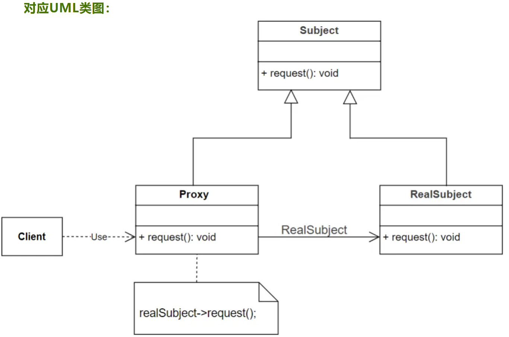

## 设计模式 Design Patterns

> **Design patterns** are typical solutions to common problems in software design. Each pattern is like a blueprint that you can customize to solve a particular design problem in your code.

> In software engineering, a **design pattern** is a general repeatable solution to a commonly occurring problem in software design. A design pattern isn't a finished design that can be transformed directly into code. It is a description or template for how to solve a problem that can be used in many different situations.

In software engineering, a **software design pattern** or **design pattern** is a general, reusable solution to a commonly occurring problem in many contexts in software design. A design pattern is not a rigid structure that can be transplanted directly into source code. Rather, it is a description or a template for solving a particular type of problem that can be deployed in many different situations. Design patterns can be viewed as formalized best practices that the programmer may use to solve common problems when designing a software application or system.

Object-oriented design patterns typically show relationships and interactions between classes or objects, without specifying the final application classes or objects that are involved. Patterns that imply mutable state may be unsuited for functional programming languages. Some patterns can be rendered unnecessary in languages that have built-in support for solving the problem they are trying to solve, and object-oriented patterns are not necessarily suitable for non-object-oriented languages.

Design patterns may be viewed as a structured approach to computer programming intermediate between the levels of a programming paradigm and a concrete algorithm.

### 单例模式 [Singleton](https://refactoringguru.cn/design-patterns/singleton)

> 单例模式是一种创建型设计模式,能够保证一个类只有一个实例,并提供一个访问该实例的全局节点.

```C++
class Logger
{
public:
    static Logger& GetInstance()
    {
        static Logger logger;
        return &logger;
    }

private:
    Logger();
    Logger(const Logger&) = delete;
    Logger(Logger&&) = delete;
}
```

### 工厂模式 [Factory](https://refactoringguru.cn/design-patterns/factory-method)

> 工厂方法模式是一种创建型设计模式,其在父类中提供一个创建对象的方法,允许子类决定实例化对象的类型.

### 策略模式

> 定义一系列策略(算法), 并进行封装,可以相互转换, 使得策略(算法)可独立于客户程序

### 观察者模式

> 定义对象间的一种一对多(变化的)的依赖关系, 当一个Object状态发生变化时, 所有依赖于其的对象都能得到通知并更新

### 责任链模式

> 多个对象(一条责任链)都有机会处理请求, 从而避免发送者和接受者之间的关系, 这这些对象连成一条链, 并沿着这条链进行传递请求, 直到有一个对象处理该请求为止

### Adapter适配器模式
- 适配器模式是一种结构型设计模式, 用于将已有接口转换为调用者所期望的另一种接口
- 适配器模式让特定的API接口可以适配多种场景; 例如,现有一个名为"Reader()"的API接口只能解析txt格式的文件，给这个Reader()接口增加适配器以后,它可以同时支持xml、json、csv等格式的文件.
- 适配器是一个特殊的类, 它可以扩展或者说转接一些特定API接口的功能, 使得API接口可以被应用到更多对象或数据类型上
- 适配器会将适配过程进行封装, 从而隐藏适配的过程, 只对外界提供被适配以后的API接口

**适配器模式的主要组件**:
- 目标接口(Target): 提供给外部程序的统一接口, 是外部调用者(client)期望使用的接口
- 源接口(Adoptee): 已经具备一定的功能, 但是与Target不兼容的接口; 它包含了client所需要的功能, 但是不能被client所使用
- 适配器(Adapter): 对源接口进行适配, 使得源接口可以像目标接口一样被公共调用; 适配器提供了Target的接口实现, 并通过继承或组合的方式调用了Adoptee的接口


**适配器模式的优点**:
- 可以实现对现有组件代码的复用
- 使得不兼容的组件之间可以成功交互
- 降低了各种接口之间的用法差异
- 方便集成第三方库或者API

> 适配器模式与桥接模式(Bridge Pattern)的区别: 两者的用途不同, 桥接模式的用途是将接口与实现分开; 适配器模式的用途是修改现有接口, 从而解决兼容问题.

#### 适配器模式的应用场景
在开发场景中, 适配器模式的应用场景有:
- 兼容相同业务下的不同接口实现
- 兼容不同的通信方式, 比如使用适配器将UDP通信转为内部的共享内存通信
- 处理代码中不同类之间交互时的兼容问题

> 在嵌入式开发场景, 经常使用的Wrapper, 也是一种适配器模式; Wrapper是指将传感器等硬件或者操作系统的底层API封装成一种高级接口或者类, 从而提供给上层应用去调用; Wrapper可以隐藏底层的具体实现细节, 使上层应用程序可以更加方便地使用底层接口; 例如 当嵌入式设备需要读写摄像头数据时, 可以把摄像头提供的SDK封装成一个Wrapper, 从而简化了调用方式. 

**不推荐使用适配器的场景**:
- 原有接口的变动很大的时候
- 对接口性能要求很高的时候
- 适配器需要适配的地方过多的时候

**UML类图**
> Adapter类继承了Target类并重写了Target类的request接口, Adapter类实现request接口的时候调用了Adoptee类提供的specificRequest接口; 整体上 相当于Adapter类为Adoptee类的specificRequest接口做了适配.


**适配器模式的分类**
- 类适配器
    - 类适配器以类继承的方式适配不兼容的源接口
    - C++语法支持继承自多个父类(钻石继承), 适配器同时继承了目标接口和源接口, 从而使得源接口的函数可以被目标接口所调用


**对象适配器**
- 对象适配器以对象组合的方式适配不兼容的源接口; 所谓的对象组合, 是指在一个对象内部调用另一个对象的成员函数
- 对象适配器中包含了源接口的实例对象, 对象适配器的可扩展性更好, 方便加入新的功能进行适配

### Bridge 桥接模式
- 桥接模式是一种结构型设计模式, 用于将抽象与实现分离, 这里的"抽象"和"实现"都有可能是接口函数或者类
- 桥接模式让抽象与实现之间解耦合, 使得开发者可以更关注于实现部分, 调用者(Client)可以更关注于抽象部分
- 桥接模式可以将一个复杂的类进行拆分为好几个类, 开发者可以修改其中任意一个类的实现, 而不影响其他类的正常运行, 该模式可以降低代码的维护工作量, 降低代码风险
- 桥接模式的核心思想就是: 抽象化(Abstraction)与实现化(Implementation)
    - 抽象化: 忽略一些细节, 将具有共同特征的不同实体抽象为同一个对象
    - 实现化: 为抽象化提供具体的逻辑和代码实现

#### **桥接模式的结构**
桥接模式主要涉及的类:
- 抽象角色类: 是一个类,定义了统一的对外接口,并定义了接口的组成结构,但是不包含接口对应的具体实现
- 具体实现类: 是一个或多个类,该类包含了对抽象角色类的接口的具体代码实现; 这些类可以根据需求变化而独立变化,且不会影响到其他类的功能; 具体实现类与抽象角色类之间的关联方式采用的是组合而非继承
- 桥接类: 充当了抽象角色类和具体实现类之间的桥梁, 负责维护抽象角色类和具体实现类之间的关系, 它允许客户端在运行时选择使用哪个具体实现类

桥接模式的主要组件:
- Abstraction: 抽象类, 提供统一的抽象接口; 内部包含对Implementor类对象的引用
- RefinedAbstraction: 扩充抽象类, 有的教程里面称为"ExtendedAbstraction", Abstraction的子类, 扩充Abstraction的抽象接口
- Implementor: 实现类, 提供了实现类的接口, 这个接口的功能和以上的抽象接口不同
- ConcreteImplementor: 提供了实现类的接口对应的代码逻辑


#### 桥接模式的应用场景
- 系统组件升级: 当需要为现有系统增加新功能或替换已有功能,但又不希望改变原有接口时
- 跨平台应用开发: 使用桥接模式来处理不同操作系统或硬件平台的差异,例如在移动端APP应用中,UI组件同时兼容ios和Android平台
- 第三方插件开发: 使用桥接模式开发出可支持多种第三方服务的组件,例如移动支付api
- API扩展: 当API的功能需要被扩展,又希望保持原有API的稳定时,使用桥接模式可以隐藏实现细节

**桥接模式的优缺点**
- 桥接模式的优点:
    - 分离接口的抽象与实现部分
    - 替代了继承的实现方式, 代码的可复用性更强
    - 桥接模式可以修改任意一个模块的功能实现而不影响整个系统
    - 可以向用户隐藏实现细节
    - 降低了类之间的依赖性
    - 代码的可维护性很强, 可以根据需求灵活地更换实现模块
- 桥接模式的缺点:
    - 引入了额外的抽象层, 使系统变得更复杂
    - 会额外增加系统的理解与设计难度
    - 接口调用增多, 带来额外的性能开销

### Proxy 代理模式
- 代理模式是一种结构型设计模式,该模式通过引入一个新的代理对象Proxy,来间接访问原始对象,从而使访问方式变得灵活和可控。
代理对象的设定减少了客户端与真实对象之间的直接交互
- 通过引入代理对象来间接访问原始的对象，达到延迟访问和隔离的效果，这就是代理模式的主要用途

#### 代理模式的结构
- 抽象对象(Subject): 定义了真实对象和代理对象的共同接口
- 真实对象(RealSubject): 又称为被代理对象，代理模式中的核心角色，定义了真正需要被代理的业务逻辑
- 代理对象(Proxy): 充当了客户端与真实对象之间的中介



**代理模式的种类**
- 简单代理(Simple Proxy): 主要用于转发请求和处理一些基本操作，例如添加日志、计时等
- 远程代理(Remote Proxy): 当主体对象在另一个地址空间(如网络地址)时，远程代理会提供远程通信的功能，进行数据的访问和转换
- 智能引用代理(Smart Reference Proxy): 也称为共享代理，它维护了多个客户端对同一目标的共享引用，并提供统一的接口
- 虚拟代理(Virtual Proxy): 延迟针对昂贵资源的访问，只有在真正使用时才加载
- 保护代理(Protection Proxy): 主要用于访问权限的控制，比如身份验证、授权等

**代理模式的应用场景**
- 延迟加载: 使资源密集型的对象仅仅在被使用时才加载，例如，访问大型数据库、加载大批量图像数据等
- 访问控制: 代理可以通过添加身份验证来控制对真实主体的访问，可用于保护敏感数据
- 缓存机制: 代理可以缓存高频次的请求，从而减少系统开销，优化性能
- 日志记录和监控: 代理可用于记录或监控对真实主体执行的操作，而无需修改其代码
- 远程访问: 在分布式系统中，真实主体可能位于不同的计算机上，代理模式可以隐藏远程通信的复杂细节
- 状态管理: 代理可以同步管理多个客户端所共享的真实主体的状态，确保它们的一致性

**代理模式的优缺点**
- 代理模式的优点:
    - 可以在不修改被代理对象的情况下，增加额外的功能或控制访问方式
    - 可以在访问对象之前和之后进行一些处理，比如添加日志、添加时间戳等
    - 可以实现远程代理，使得客户端可以通过网络访问远程的对象
    - 可以防止未经授权访问真实主体
- 代理模式的缺点:
    - 引入新的类，增加代码复杂性
    - 读取资源时，需要通过代理来间接访问，造成额外的性能损失

### Decorator 装饰器模式
- 装饰器模式是一种结构型设计模式,它允许在不改变现有对象的情况下,动态地将功能添加到对象中
- 装饰器模式是通过创建具有新行为的对象来实现的,这些对象将原始对象进行了包装
- 装饰器模式遵循开放/关闭原则,允许开发者在不修改现有代码的情况下添加新的装饰器
- 日常开发中常用的装饰器属于类装饰器,通过继承父类来实现

#### 装饰器模式的结构
- 抽象组件(Component): 被装饰的对象, 声明了对外的统一接口
- 具体组件(ConcreteComponent): 包含抽象组件接口的具体代码实现
- 抽象装饰器(Decorator): 包含对抽象组件的指针或引用, 并定义了与抽象组件一致的接口
- 具体装饰器(ConcreteDecorator): 包含抽象装饰器接口的具体代码实现, 并且可以在调用对外接口之前或之后添加额外的行为


#### 装饰器模式的应用场景
- 组件扩展: 在大型项目中,随着业务的增加,必定要添加新的功能,装饰器此时可以避免修改原有的基础组件
- API增强: 当提供API给第三方进行调用时,装饰器可以用于添加额外的功能,比如日志记录、安全校验等，而调用者无需知道具体的细节
- 权限管理: 装饰器可以用来控制对原有的特定接口的访问权限
- 缓存机制: 在网络请求或数据库查询等操作中,装饰器可以用来添加额外的缓存、重试、超时处理等功能

**装饰器模式的优缺点**
- 装饰器模式的优点:
    - 可以动态地添加或删除对象的功能, 无需修改原有的代码
    - 不影响现有对象的结构, 符合开闭原则
    - 可以灵活地扩展原有对象的功能
    - 可以使用多个装饰器对象来组合多种功能
    - 使得代码可以根据需要轻松地添加或移除功能
- 装饰器模式的缺点:
    - 使系统中增加额外的类变量
    - 装饰器对象与原始对象之间的关系过于复杂, 降低代码可读性

### Facade 外观模式
- 外观模式是一种结构型设计模式,又称为门面模式,也是一种基于创建对象来实现的模式,为子系统中的各组接口的使用提供了统一的访问入口
- 外观模式对外提供了一个对象,让外部客户端(Client)对子系统的访问都是基于该对象来完成,这个对象被称为外观对象(Facade Object),外观对象为子系统的访问提供了一个简单而且统一的入口
- 客户端只需要关注Facade提供的对外接口的用法, 而不需要关注子系统之间的复杂交互等细节

#### 外观模式的结构
- 外观对象(Facade): 它的底层封装了系统的各个子模块,向用户屏蔽了底层的复杂结构,在内部调用各种子系统的函数,对外提供一些简化的接口
- 子系统对象(SubSystem): 是组成复杂系统的各个独立模块,它们各自实现特定的功能,然后被Facade统一调用


#### 外观模式的应用场景
- 系统集成: 当多个组件或服务接口需要被统一管理和使用时,借助外观模式构建一个统一的入口
- API升级: 当API升级时,为了兼容旧版本的API接口的使用,创建一个外观模式的对象,既可以对外提供新的API接口,又向后兼容旧的API接口
- 开发第三方库或框架: 针对大型的库或者框架的开发,为了简化用户的使用,隐藏底层实现,对外提供一个简单且统一的接口
- 组件整合: 为了让项目中兼容不同架构和使用方式的组件时, 使用外观模式来规范化组件的调用方式

**外观模式的优缺点**
- 外观模式的优点:
    - 减少了需要客户端关注和处理的对象数,简化了接口的使用方式
    - 实现了子系统和客户端之间的解耦,使子系统的变更不会影响到客户端的调用方法
    - 降低了大型软件的编译难度,简化了大型软件在不同平台之间的移植过程
    - 对外提供接口的同时,可以针对单个子系统实现单独的优化和升级
    - 避免了客户端对内部底层逻辑的影响和破坏
    - 促进了子系统的模块化和可重用性
- 外观模式的缺点:
    - 对底层的过度包装会增加性能开销
    - 如果设计的不合理,会使重构变得有难度
    - 如果存在访问共享资源的情况,代码的编写不够严谨时,相同层次的子系统和子系统之间可能会互相影响
    - 子系统和子系统之间可能包含相同的功能,导致代码冗余


### Reference

- [设计模式（全23种)](https://subingwen.cn/design-patterns/)
- [Design Patterns](https://refactoringguru.cn/design-patterns/cpp)
- [图说设计模式](https://design-patterns.readthedocs.io/zh-cn/latest/index.html#)
