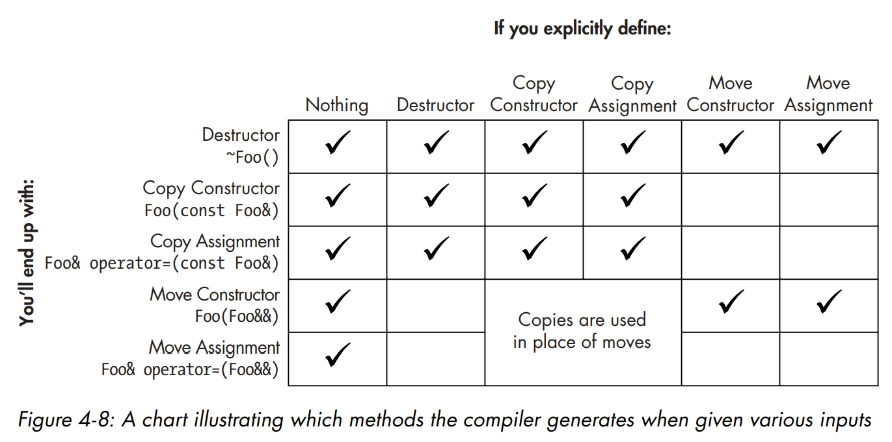

## 现代 C++ 编程：从入门到实践

> Stay Hungry, Stay Foolish. Talk is cheap, Show me the code. 技巧和知识点都在代码注释中. C++是最主要的系统编程语言, 许多C语言知识都可以直接用到C++中, 同时也将学到许多新概念, 随着对C++的一些深层主题的掌握,会发现 Modern C++相比C语言有许多实质性的优势, 能够在代码中简洁地表达想法, 利用令人印象深刻的标准库STL在更高的抽象水平编写代码, 采用模板来提高运行时的性能、强化代码复用, 并依靠C++对象生命周期来管理资源.

### Features
- C++ 语言对比 C 语言的优势
    - constexpr 关键字指示编译器在编译时期对表达式求值
    - overload 函数重载(本质函数签名唯一), 代码复用vec_double
    - C++的引用(reference)是指针(pointer)处理的改进, 安全特性更强
    - 命名空间与结构体、联合体和枚举的隐式类型定义(typedef)
    - C and C++ 对象文件的混用, 链接阶段的调用约定和符号导出
    - for-range 简洁地表达想法和重用代码
    - C++ 标准库(STL)包含了高性能的泛型代码, 容器、迭代器和算法
    - lambda 函数, 提高代码的局部性
    - 模板(template)的泛型(generic)编程, 是指写一次代码就能适用于不同的类型
    - C++ 资源获取即初始化(RAII)技术管理对象生命周期
    - 所有权模型来管理动态对象的生命周期: 智能指针和移动语义
- C++ 对象生命周期    
    - 对象的生命周期是C++对象会经历的一系列阶段
    - 对象的存储期, 对象会分配相应的存储空间
    - 对象生命周期与异常机制结合，以稳健、安全、优雅的方式处理错误并清理资源
    - 移动语义和复制语义, 提供了针对对象生命周期的更细粒度的控制



### Quick Start
```shell
# step 1. download and install Visual Studio Code(VSCode)
# step 2. download and install VS/GCC/Clang Toolchain
# step 3. download and install CMake and Ninja
# step 4. install extension in VSCode
mkdir code && cd code
git clone --recursive https://github.com/2694048168/C-and-C-plus-plus.git
cd CppModernCourse

# build and compile
cmake -S . -B build -G Ninja
cmake --build build --config Release

# running the example program
./bin/01_00_firstProgram.exe
```

### Organization
```
. CppModernCourse
|—— 00_OvertureCProgrammers
|   |—— 00_constexpr.cpp
|   |—— 05_objectFileHybrid.cpp
|   |—— CMakeLists.txt
|—— 01_UpAndRunning
|   |—— CMakeLists.txt
|—— 02_Types
|   |—— CMakeLists.txt
|—— 03_ReferenceType
|   |—— CMakeLists.txt
|—— 04_ObjectLifeCycle
|   |—— CMakeLists.txt
|—— 05_RuntimePolymorphism
|   |—— CMakeLists.txt
|—— 06_CompileTimePolymorphism
|   |—— CMakeLists.txt
|—— 07_Expressions
|   |—— CMakeLists.txt
|—— CMakeLists.txt
|—— bin
|—— build
|—— .gitignore
|—— .clang-format
|—— LICENSE
|—— README.md
```

> First off Debug/Release are called configurations in cmake.

If you are using a single configuration generator (Ninja/Unix-Makefiles) you must specify the CMAKE_BUILD_TYPE. Like this:
```shell
# Configure the build
cmake -S . -B build/ -D CMAKE_BUILD_TYPE=Debug -G Ninja
# Actually build the binaries
cmake --build build/

# Configure a release build
cmake -S . -B build/ -D CMAKE_BUILD_TYPE=Release -G Ninja
# Build release binaries
cmake --build build/
```

For multi-configuration generators it's slightly different (Ninja Multi-Config, Visual Studio). Like this:
```shell
# Configure the build
cmake -S . -B build -G Ninja

# Build debug binaries
cmake --build build --config Debug

# Build release binaries
cmake --build build --config Release
```

scp 是 secure copy 的缩写, scp 是 linux 系统下基于 ssh 登陆进行安全的远程文件拷贝命令, 复制文件和目录.
```shell
# 1、从本地复制到远程
scp -r -p -v local_folder remote_username@remote_ip:remote_folder

# 2、从远程复制到本地
scp -r -p -v remote_username@remote_ip:remote_folder local_folder

# 如果远程服务器防火墙有为scp命令设置了指定的端口，需要使用 -P 参数来设置命令的端口号
# scp 命令使用端口号 4588
scp -P 4588 -r remote_username@remote_ip:remote_folder local_folder
```

虚拟机安装Ubuntu24-Noble
```shell
# 1、安装TOOLS
sudo apt install open-vm-tools
sudo apt install open-vm-tools-desktop

# 2、安装SSH
sudo apt install openssh-server

# 3. 配置SSH
sudo vim /etc/ssh/sshd_config
# 找到下面内容
PermitRootLogin yes
PasswordAuthentication yes

# 4. 设置开机自启动
sudo systemctl enable ssh
sudo systemctl is-enabled ssh

# 5. 启动SSH服务
sudo systemctl status ssh
```
