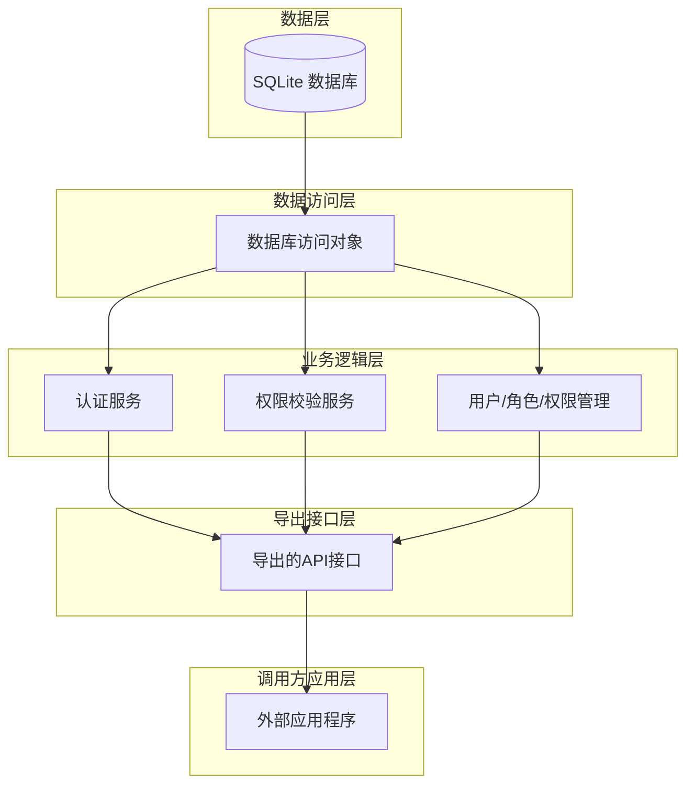

## RBAC(Role-Based Access Control),基于角色的访问控制模型，将权限管理系统划分为五个层次：
- 数据层：SQLite 数据库存储用户、角色、权限信息及关联关系
- 数据访问层：封装数据库 CRUD 操作，提供统一的数据库访问接口
- 业务逻辑层：实现权限校验、登录认证、用户管理等核心业务逻辑
- 导出接口层：通过导出宏暴露给外部调用方的 API 接口
- 调用方应用层：外部程序动态加载 DLL 并调用权限管理功能

