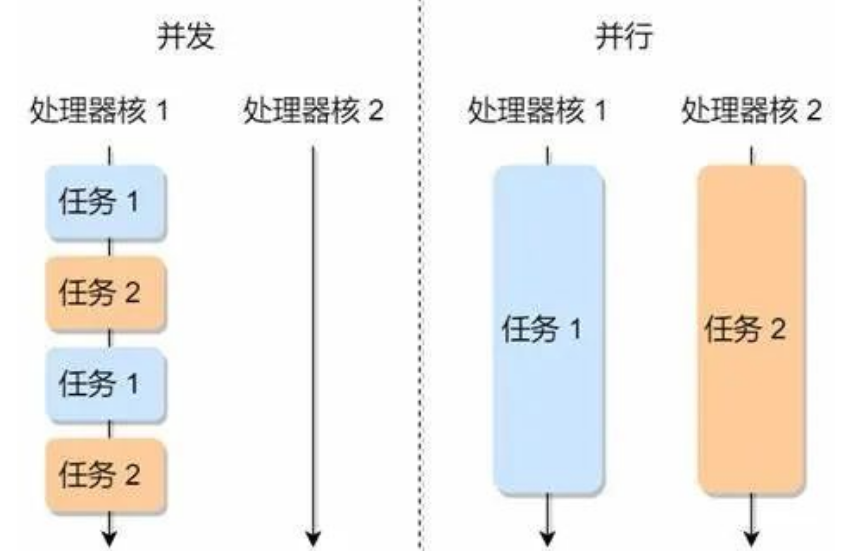
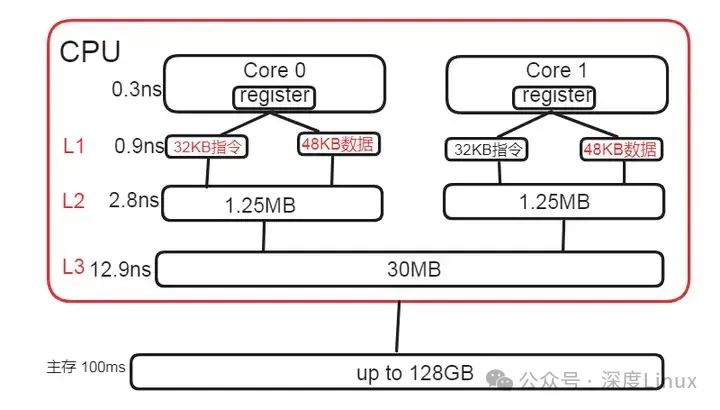
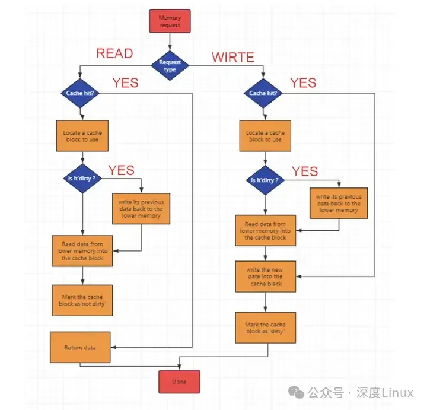

## Modern C++ tricks

> the Best Practices tricks for Modern C++

> What I cannot create, I do not understand. Know how to solve every problem that has been solved. Quote from Richard Feynman


```shell
cmake -S . -B build -G "Visual Studio 17 2022" -DCMAKE_BUILD_TYPE:STRING=Debug 
cmake -S . -B build -G "Visual Studio 17 2022" -DCMAKE_BUILD_TYPE:STRING=Release 

cmake --build build --config Debug
cmake --build build --config Release
```

### C++设计函数内部实现的建议

> 函数是 C++ 代码实现功能的具体表示, 所以优化代码的结构、性能和可维护性对写出高质量的c++代码极为重要

- 确保参数有效性: 
    - 函数入口处的参数检查非常重要，可以确保输入是有效的，避免后续代码执行时出错
    - 对指针类型的参数进行空指针检查
    - 对整数、浮点数等类型的参数进行范围检查
    - 对容器进行空检查
- 减少重复代码(DRY 原则): 
    - 如果函数内部出现重复代码,可以将重复部分提取为辅助函数,提升代码可读性和可维护性
    - inline small helper-function
    - lambda expression function
- 处理异常: 
    - 在函数内部进行异常捕获和处理, 确保函数在运行过程中遇到问题时不会导致程序崩溃; 
    - 对于可能会引发异常的代码块, 使用 try-catch 进行管理;
    - 建议不使用 try-catch 模式
    - 采用 Result Status 返回 error-no 枚举, 外部调用者做处理
- 局部变量初始化: 
    - 始终确保局部变量在使用前被初始化, 以避免未定义行为; 尤其是在类成员函数中, 可能有未初始化的成员变量
    - POD 数据一定声明即初始化
    - 结构体在声明并给定合理初始值
    - 指针声明即初始化 nullptr
    - 类变量声明即列表初始化 {}
    - 采用 memset(Struct_Variable, 0, sizeof(Struct))
- 合理使用早退出(Guard Clauses): 
    - 使用早退出(guard clauses)来处理错误或特殊情况, 避免嵌套代码, 提高代码的可读性
- 优化循环结构:
    - 在循环中如果能减少不必要的操作或计算, 就能显著提高性能; 例如将不变的表达式移到循环外
    - 现代编译器开启优化, 编译器会对**循环**部分代码做优化
- 明确函数的职责: 
    - 一个函数应尽量只做一件事, 遵循单一职责原则(SRP)
    - 如果函数内部的逻辑过于复杂, 考虑将其拆分成多个小函数, 以提高可读性和维护性
- 减少嵌套:
    - 函数内部嵌套过多会影响可读性, 尽量通过逻辑提取或早退出来减少嵌套层次
    - 不要出现 if-if-if-if 多层嵌套的情况


### CRTP(Curiously Recurring Template Pattern)是一种 C++ 编程技巧

> CRTP(Curiously Recurring Template Pattern)是一种 C++ 编程技巧, 使用模板类和继承的组合来实现静态多态. 该模式的关键思想是: 在模板类的定义中, 模板参数是当前类自身(通常是派生类), 这个技巧通常用于实现编译时多态, 优化性能. 因为C++运行时多态,需要虚函数和虚函数表的支持, 存在一定的性能开销.

```C++
// 先定义一个模板类作为基类
template <typename T>
class Base
{
    // ...
};

 // 定义一个派生类，这个类继承以自身作为参数的基类
class Derived : public Base<Derived>
{
    // ...
};
```

#### **静态多态(CRTP)和动态多态对比**

| 特性       | CRTP（静态多态）          | 动态多态 |
|  ----     | ----          |----  |
| 性能	    | 高效，无运行时开销	| 有虚函数表查找开销，性能略低 |
| 灵活性	    | 受限，类型在编译时固定	| 灵活，类型可以在运行时动态选择 |
| 类型安全性	    | 高，编译时检查	| 低，存在类型转换失败风险 |
| 编译期 vs 运行期	    | 完全在编译时	| 依赖运行时 |
| 耦合性	    | 较高，A 模块使用 B 模块中的 CRTP 实现，涉及到的符号都得对 A 模块可见	| 较低，A 模块使用 B 模块中的接口类，接口实际实现的类不需要对 A 模块暴露 |
| 可读性	    | 很差，涉及到模版，还存在代码体积膨胀问题	| 较差 |

CRTP 能在编译时就规划好所有的函数调用路径,特别适合那些需要高性能,同时又想要优雅地复用代码的场景:
- 游戏引擎中的组件系统
- 高性能计算库
- 图形渲染管线

CRTP 的"安全检查员"是怎么工作,保证编译期类型正确
- C++ 的魔法,用编译时多态的方式,代码既快速又优雅
- C++ 的魔法, 静态检查不是限制,而是保护,它让代码更安全、更可靠
- CRTP 和链式调用的完美组合

```C++
template<typename Derived>
class Shape {
public:
    // 这位可爱的检查员会确保所有图形都乖乖继承自 Shape 哦！🎯
    static_assert(std::is_base_of<Shape<Derived>, Derived>::value,
                 "哎呀呀，你是不是忘记继承 Shape 啦？快去补救吧！🤔");
                 
    double area() {
        // 这里的检查就像是点名一样，确保每个图形都会计算自己的面积 📏
        static_assert(std::is_member_function_pointer<
            decltype(&Derived::computeArea)>::value,
            "咦？computeArea 方法不见啦！是不是忘记写啦？✍️");
            
        // 通过检查的小可爱就可以愉快地计算面积啦～ 🌟
        return static_cast<Derived*>(this)->computeArea();
    }
};
```

#### 性能对比：CRTP vs 虚函数, 为什么 CRTP 能比虚函数快
- 虚函数的工作方式:
    - 每个带虚函数的类都有一个虚函数表(vtable)
    - 每次调用虚函数时都需要:
    - 这些间接操作会带来性能开销
        1. 查找对象的 vtable 指针
        2. 在 vtable 中找到正确的函数地址
        3. 通过函数指针进行调用
- CRTP 的工作方式:
    - 在编译时就确定了所有函数调用
    - 编译器可以直接内联函数调用
    - 没有运行时查表开销
    - 不需要存储额外的 vtable 指针

> 虚函数就像是在跑步时需要不断查看路标的选手, 而 CRTP 就像是把整个路线图都记在脑子里的选手, 当然要跑得更快啦. 小贴士: 在现代 CPU 中, **间接跳转**(比如虚函数调用)可能会导致**分支预测失败**, 进一步影响性能, 而 CRTP 的直接调用则完全避免了这个问题.

#### CRTP 的局限性：there's no such thing as a free lunch
- 编译时绑定的限制,无法像虚函数那样灵活地进行运行时多态
- CRTP 的接口变更的烦恼
    - 模板的特性决定了所有使用这个基类的代码都需要看到完整的定义
        - 不像普通类可以只提供声明
        - 模板必须在头文件中完整定义
    - 连锁反应超级可怕
        - 修改基类 -> 所有派生类受影响
        - 派生类变化 -> 使用派生类的代码要重新编译
        - 最后可能整个项目都要重新编译
    - 提前规划好接口
        - 仔细思考可能需要的所有功能,先把蓝图设计好
        - 一次性把接口设计完整,考虑未来可能的扩展
    - 使用组合而不是继承,善用组合来降低耦合度
- 代码膨胀问题
    - 把共同的大块代码放到非模板基类中
    - 使用策略模式分离可复用的代码
- 调试起来有点累
    - 添加静态断言来提供更友好的错误信息,添加适当的检查和注释
    - 使用更清晰的命名约定,使用好的命名规范
    - 添加详细的注释说明,保持代码结构清晰
- 运行时类型检查不太方便
    - 编译时类型检查
    - 自定义类型检查方法

```C++
// =========把共同的大块代码放到非模板基类中
class CommonBase {
protected:
    void heavyOperation() {
        // 把占空间的代码放这里
        // 所有派生类共用这一份! 🎉
    }
};

template<typename Derived>
class Base : protected CommonBase {
    // 这里只放必要的 CRTP 相关代码 ✨
};

// ========使用策略模式分离可复用的代码
class Strategy {
public:
    void complexOperation() {
        // 把复杂操作集中在这里管理 🎮
    }
};

template<typename Derived>
class Base {
    Strategy strategy;  // 通过组合来复用代码 🤝
};

// ========自定义类型检查方法
template<typename Derived>
class Animal {
protected:
    // 给每种动物一个独特的标识 🏷️
    enum class AnimalType { Dog, Cat, Bird };
    
    // 让派生类告诉我们它是什么动物
    virtual AnimalType getType() const = 0;
};

class Dog : public Animal<Dog> {
protected:
    AnimalType getType() const override {
        return AnimalType::Dog;  // 我是汪星人! 🐕
    }
};
```

> 小贴士: 如果项目经常需要修改接口,那么传统的虚函数可能更适合哦! 毕竟灵活性有时候比性能更重要. 在使用 CRTP 时,要像个精明的收纳师一样,把代码合理安排,避免不必要的重复. 在开发 CRTP 代码时,建议先写好单元测试,这样可以更早地发现潜在问题,省得到时候debug到头秃. 如果程序真的需要频繁的运行时类型检查,那么虚函数可能是更好的选择哦！每个工具都有自己的用武之地.

CRTP 最适合这些场景:
- 追求极致性能的应用
- 在编译时就能确定所有类型关系的情况
- 不需要运行时改变对象类型的场景

虚函数更适合:
- 需要运行时多态的场景
- 要通过基类指针/引用操作对象的情况
- 插件式架构或需要动态加载的系统

> 记住啦 在编程世界里没有最好的方案 只有最适合的选择！要权衡性能、灵活性和维护性这些因素,选择最适合的方案

使用 CRTP 的时候要注意以下几点
- 派生类必须正确继承基类模板
- 要小心循环依赖
- 模板代码可能会导致代码膨胀
- 编译错误信息可能比较难懂

**多线程处理图像**



**创建线程的五种类型**
- 使用 std::thread via modern C++ since C++11
- 使用 std::async: 基于 std::thread 的封装,不仅创建了一个线程,还返回一个 std::future 对象,可以用来获取异步操作的结果
- 使用 POSIX 线程 pthread, 尤其是在需要更底层控制时(UNIX-like 系统中使用的标准线程库)
- 使用 Windows 线程 CreateThread, 操作系统级别的线程创建方法
- 使用线程池,管理一组工作线程,允许提交任务给线程池处理,而不是每次都创建和销毁线程,减少资源消耗和提高效率

```C++
#include <iostream>
#include <pthread.h>

void* hello(void*) {
   std::cout << "Hello from pthread\n";
   return nullptr;
}

int main() {
   pthread_t tid;
   pthread_create(&tid, nullptr, hello, nullptr);
   pthread_join(tid, nullptr);
   return 0;
}
```

#### condition_variable 的原理

```
┌──────────────────────────────────────────┐
│ 线程调用 wait(lock) 或 wait(lock, pred)    │
└───────────────┬──────────────────────────┘
                │
                ▼
┌──────────────────────────────────────────┐
│ 释放传入的锁（lock），                       │
│ 将线程加入条件变量的等待队列                  │
└───────────────┬──────────────────────────┘
                │
                ▼
┌──────────────────────────────────────────┐
│ 等待通知（notify_one 或 notify_all）       │
│ 或发生虚假唤醒                             │
└───────────────┬──────────────────────────┘
                │
                ▼
┌──────────────────────────────────────────┐
│ 被唤醒后，线程重新尝试获取传入的锁             │
└───────────────┬──────────────────────────┘
                │
                ▼
   ┌───────────────────────────────────────────────┐
   │ 是否为带谓词形式？                               │
   ├───────────────┬───────────────────────────────┤
   │ 是                                            │ 否
   ▼                                               ▼
┌───────────────────────────┐       ┌────────────────────────────────────┐
│ 检查谓词 pred 是否满足       │       │ 线程不检查条件，线程继续执行           │
├───────────────────────────┤       └────────────────────────────────────┘
│ 若不满足，则继续等待         │
│（重新进入等待队列）          │
└───────────────┬───────────┘
                │
                ▼
┌──────────────────────────────────────────┐
│ 谓词满足，线程继续执行                       │
└──────────────────────────────────────────┘


虚假唤醒是指线程在没有收到通知的情况下从 wait 返回
这可能是由操作系统、硬件或条件变量的底层实现引起的。

如何处理虚假唤醒？
使用带谓词的 wait，让线程在被唤醒后自动检查条件是否满足

使用 notify_one 进行高效唤醒
在需要唤醒所有线程时使用 notify_all

```

### 深入理解CPU缓存：性能优化的关键
- 现代 CPU 为了弥合处理器与主内存之间巨大的速度差异, 引入了多级缓存体系



```shell
getconf -a
getconf --all

# LEVEL1_ICACHE_SIZE                  32768
# LEVEL1_ICACHE_ASSOC                 8
# LEVEL1_ICACHE_LINESIZE              64
# LEVEL1_DCACHE_SIZE                  32768
# LEVEL1_DCACHE_ASSOC                 8
# LEVEL1_DCACHE_LINESIZE              64
# LEVEL2_CACHE_SIZE                   262144
# LEVEL2_CACHE_ASSOC                  4
# LEVEL2_CACHE_LINESIZE               64
# LEVEL3_CACHE_SIZE                   16777216
# LEVEL3_CACHE_ASSOC                  16
# LEVEL3_CACHE_LINESIZE               64
```

- 缓存行是缓存与主内存之间数据传输的基本单位; 它由标志位、标记和数据区域组成

> 标志位用于指示缓存行的状态，例如是否有效、是否被修改等。标记则用于唯一标识缓存行中的数据在主内存中的位置。当 CPU 需要访问某个内存地址的数据时，首先会根据地址计算出对应的缓存行标记，然后检查缓存中是否有匹配的缓存行。如果有，并且标志位显示该缓存行有效，那么就可以直接从缓存行的数据区域中获取数据。

> 缓存行的大小通常为几十到几百个字节不等。不同的处理器架构可能会有不同的缓存行大小。在读取数据时，CPU 会以缓存行为单位进行读取，即使只需要访问一个字节的数据，也可能会将整个缓存行加载到缓存中。这样做的目的是为了提高后续访问同一缓存行中其他数据的速度。

> 当CPU访问内存时，如果所需数据在缓存中已经存在于一个Cache Line中，那么CPU可以直接从缓存中读取数据，而无需访问主存，从而提高了数据传输的速度。


- 标志位（flag）: 用于指示Cache Line当前是否有效。当一个Cache Line中存储的数据被更新或替换时，标志位会被清除，表示该Cache Line不再有效,（存 MESI 的状态）
- 标记（tag）: 用于标识数据区域中存储的数据块是来自哪个主存地址。当CPU需要读取或写入特定地址的数据时，它会将该地址的一部分作为标记，并与Cache Line中存储的标记进行比较，以确定是否命中缓存
- 数据区域（data）：用于存储从主存中读取的数据块

> 在数据读取方面，CPU 以缓存行为单位进行读取。即使只需要访问一个字节的数据，也可能会将整个缓存行加载到缓存中。这是因为在实际应用中，程序的局部性原理使得后续很可能会访问同一缓存行中的其他数据。这样一次读取整个缓存行可以提高后续访问的速度，减少对主内存的访问次数，从而提升系统性能.

> 在数据一致性方面，缓存行的存在使得多个处理器在访问共享数据时需要考虑缓存一致性问题。当一个处理器修改了某个缓存行中的数据，其他处理器需要通过一定的机制（如总线嗅探等）来保证自己缓存中的副本数据也得到更新，以维持数据的一致性.

#### 理解写回策略

> 写回策略的核心思想是先将更新的数据写入缓存，而不是立即写回主内存。当缓存中的数据被修改后，该缓存行被标记为 “脏数据”，表示与主内存中的数据不一致。只有在特定的情况下，比如缓存行需要被替换或者系统显式地要求将数据写回主内存时，才会将脏数据写回主内存。

> 这种策略的主要优点在于减少了对主内存的访问次数。由于主内存的访问速度相对较慢，通过延迟写回操作，可以让 CPU 在处理数据时更加高效。同时，对于那些在短时间内可能会被再次修改的数据，避免了频繁地写入主内存，从而提高了系统的整体性能。

> **写请求处理**：当 CPU 发出写请求时，首先会检查要写入的数据是否已经在缓存中。如果在缓存中，就直接将数据写入对应的缓存行，并将该缓存行标记为脏数据。如果数据不在缓存中，可能会根据缓存替换策略从主内存中加载包含该数据的缓存行到缓存中，然后再进行写入操作。 若命中，直接将新数据写入缓存，并且标记为脏数据dirty（缓存中修改过但尚未写回到更高级别缓存或主内存中的数据）。注意此时不会写入内存。 若未命中，分配一个缓存块Cache Line，判断当前缓存块是不是脏数据。如果是，先将缓存块的数据写回内存中，再将新数据写入缓存块。如果不是脏数据，直接从内存中读到缓存块中（建立内存块与缓存块的索引关系），再将新数据写入缓存块，并标记为dirty。

> 例如，在一个多线程的程序中，一个线程修改了某个变量的值。这个变量可能已经被缓存在 CPU 的某个级别的缓存中。此时，CPU 会直接将新的值写入缓存行，并标记为脏数据。后续如果其他线程需要读取这个变量，首先会在缓存中查找，如果找到，就可以直接使用缓存中的数据，而无需访问主内存。

> **读请求处理**：当 CPU 发出读请求时，会依次在各级缓存中查找所需的数据。如果在某一级缓存中找到数据，并且该缓存行有效，就直接从该缓存行中读取数据。如果在所有缓存中都未找到数据，就需要从主内存中读取数据，并将其加载到缓存中，以便后续的访问能够更快地获取数据。若命中，直接返回其数据；若未命中时，分配一个缓存块，判断当前缓存块是不是脏数据。如果是，先将缓存块的数据写回下一级存储中，再从内存读取新数据到缓存块中。如果不是脏数据，直接从内存中读到缓存块中，修改dirty位为clean（未被修改）。最后返回数据。

> 例如，当一个程序首次访问某个数据时，CPU 会从主内存中读取该数据，并将包含该数据的缓存行加载到 L1 缓存中。如果后续再次访问这个数据，由于数据已经在缓存中，就可以直接从 L1 缓存中快速读取，大大提高了访问速度。



> 这种策略的主要优势在于减少了向主内存写入数据的次数。相比于每次数据修改都直接写入主内存（写直达，Write Through），写回策略可以将多次对同一块数据的修改累积起来，一次性地写回主内存，减少了对主内存的访问，提高了效率。

#### 应对缓存一致性问题
- (1)硬件层面的措施
    - ①总线监听(Bus Snooping)
    - ②缓存一致性协议(Cache Coherence Protocol): MESI(Modified、Exclusive、Shared、Invalid)协议
    - ③缓存锁定(Cache Locking)
- (2)软件层面的措施
    - ④使用同步原语(Synchronization Primitives): 锁、信号量
    - ⑤优化数据访问模式(Optimizing Data Access Patterns)

#### 内存序问题
> 在多线程编程中，内存序问题指的是不同线程对内存中共享数据的访问顺序的不确定性。内存序决定了在多线程环境下，对共享内存的读写操作的可见性和顺序性。不同的内存序选项会影响编译器和处理器对代码的优化方式，从而导致不同线程可能看到不同的内存操作顺序。

> 例如，在一个多线程程序中，线程 A 写入一个变量，线程 B 读取这个变量。如果没有明确指定内存序，编译器和处理器可能会对这些操作进行重排序，使得线程 B 在变量还未被线程 A 写入时就读取了该变量，从而导致错误的结果。

- 内存序的原理涉及到编译器优化、处理器执行以及多线程环境下对共享内存的访问规则
    - (1)编译器优化与重排序
    - (2)处理器执行与内存模型
    - (3)内存序的作用: 不同的内存序选项提供了不同程度的约束
- 内存屏障: 内存栅栏(memory barrier), 是一种用于确保在多线程环境下内存操作顺序的机制

### C++17 magic features
- C++17 std::invoke 一个函数统治所有函数
- C++17 std::byte, 别再用 unsigned char
- 明智地使用智能指针, 过度使用std::shared_ptr可能会因引用计数而产生额外开销
```C++
std::shared_ptr<MyClass> ptr(new MyClass()); // NOT good

auto auto ptr = std::make_unique<MyClass>(); // good
```
- 利用移动语义尽量减少复制, 复制大型对象是一种隐蔽的性能杀手
```C++
std::vector<MyClass> vec;
vec.push_back(someLargeObject); // 复制对象

std::vector<MyClass> vec;
vec.push_back(std::move(someLargeObject)); // 移动对象
```
- 为std::vector预留内存 如果知道std::vector中大概需要多少元素,提前预留内存可以通过减少重新分配内存的次数来节省时间
```C++
std::vector<int> data; // NOT good
for (int i = 0; i < n; ++i) {
    data.push_back(i);
}

std::vector<int> data;
data.reserve(n); // good
for (int i = 0; i < n; ++i) {
    data.push_back(i);
}
```
- 优先使用前缀自增而非后缀自增, 当使用迭代器或简单的计数器时，使用前缀自增（++i）可能会比后缀自增（i++）稍微更高效一些，特别是对于复杂的迭代器类型来说
```C++
// NOT good
for (auto it = container.begin(); it!= container.end(); it++) {
    // 执行某些操作
}

// good, 这可能看起来有点吹毛求疵，但在紧密的循环中，每一微秒都很重要
for (auto it = container.begin(); it!= container.end(); ++it) {
    // 执行某些操作
}
```
- 在不必要时避免使用虚函数,虚函数会因动态分派而增加开销;如果不需要多态行为,别用virtual关键字
> 所有类的方法都加上virtual关键字“以防万一”——大错特错啊, 程序性能一落千丈
- 谨慎使用异常处理,异常功能很强大，但如果过度使用可能成本很高，特别是在对性能要求苛刻的代码中
> 建议使用 'ReturnStatusErrorCode' 范式进行处理异常, 而不是 try-catch
- 利用编译时多态(CRTP技术)，模板和内联函数可以帮助实现多态，同时又不会有虚函数带来的运行时开销
- 在优化之前先进行性能分析 这虽然不是一个直接的编码技巧，但却至关重要
> 在做出更改之前,使用性能分析工具(优化必须要有测度)来确定瓶颈所在; gprof, Valgrind, Visual Studio Profiler
