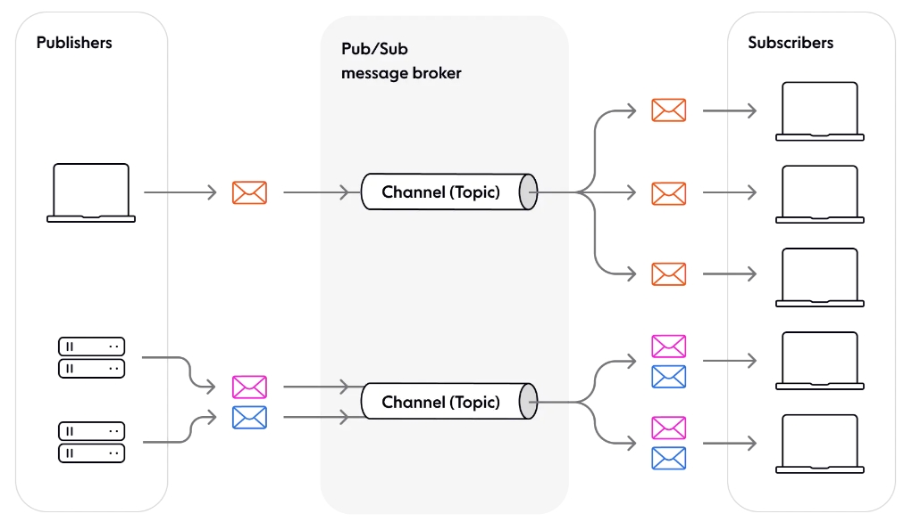

### Publish-Subscribe Message Mechanism 

> 发布-订阅（Publish-Subscribe）模式是一种消息传递模式，用于构建分布式系统中的通信机制。在这种模式下，消息的发送者（发布者）和消息的接收者（订阅者）之间通过一个称为“主题（Topic）”的中介进行通信。发布者将消息发布到特定的主题上，而订阅者可以选择订阅感兴趣的主题，并在消息发布到该主题时接收消息。在设计模式中也有一种类似的描述行为的模式, 叫做观察者模式, 观察者模式允许定义一种订阅机制, 可在对象事件发生时通知所有的观察者对象, 使它们能够自动更新.



#### **Quick Start**

```shell
cmake -S . -B build
cmake --build build # for single-configure
cmake --build build --config Release # for VS multiple-conf

./build/Release/PublisherSubsciber.exe
./build/PublisherSubsciber
```

#### **Usage Example**

```C++
#include "AppSubscriber.hpp"
#include "MessageCenter.hpp"
#include "Publisher.hpp"
#include "TopicMessage.hpp"

// ------------------------------------
int main(int argc, const char **argv)
{
    MessageCenter::getInstance()->Run();

    AppSubscriber appSub;
    Publisher     appPub;

    appSub.Subscribe("Person");
    appSub.Subscribe("Person");

    //appSub.UnSubscribe("Person");

    Person ps{"sma", 18};

    Person ps1{"wxq", 17};

    appPub.Publish("Person", &ps, sizeof(ps));
    while (true)
    {
        //appPub.Publish("Person", &ps, sizeof(ps));
        appPub.Publish("Person", &ps1, sizeof(ps1));
    }
    
    return 0;
}
```
