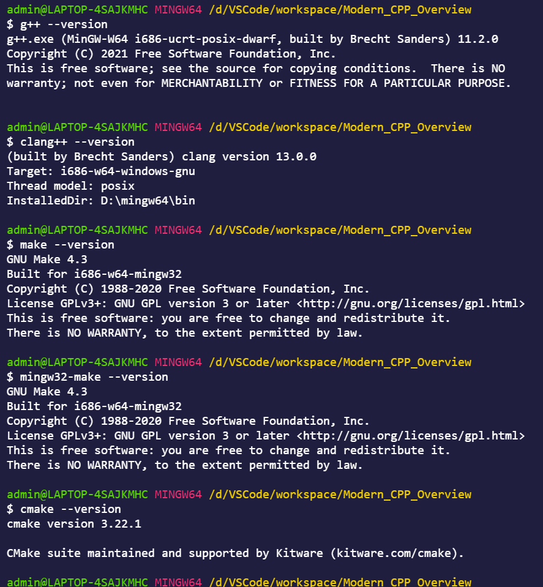

# MOdern C++ Overview: C++ 11/14/17/20

**[Reference Book GitHub](https://github.com/changkun/modern-cpp-tutorial)**

**[MinGW Compiler Tools](https://winlibs.com/)**

**[GNU GCC Compiler Tools](https://gcc.gnu.org/)**

**[Clang Compiler Tools](https://clang.llvm.org/)**

**[CMake Tool](https://cmake.org/)**

--------------------------------------------------------------------------------

## Step 0. 纵观历史, 高屋建瓴(没有过去, 哪有未来)

- Traditional C++ refers to C++98 and its previous standards
- Modern C++ refers to C++11/14/17/20 standards
- Modern C++ features: auto keyword; Lambda expressions; rvalue references
- Modern C++17: small and beautiful languages and features, such as structured binding
- Modern C++ tools and methods: cross-platform std::thread; regular expression std::regex
- 31 nooby C++ habits you need to ditch; **Example: 00_cpp_habits_ditch**

## Step 1. 轮海境界(开辟苦海, 修成命泉, 架设神桥, 到达彼岸)

- Main features that have deprecated since C++11
- Compatibilities with C
- [C++ compiler support](https://en.cppreference.com/w/cpp/compiler_support)
- [C and C++ Differences](http://david.tribble.com/text/cdiffs.htm#C99-vs-CPP98)
- Separate the C and C++ code with extern "C", and then unify the link
- https://quant67.com/post/C/mix-c-cpp.html
- **Example: 01_extern_unify_link**

## Step 2. 道宫境界(心之神藏, 肝之神藏, 肺之神藏, 肾之神藏, 脾之神藏)

- Language usability enhancements
- Constants: nullptr; **Example: 02_constant_nullptr**
- Constants: constexpr; **Example: 03_constant_constexpr**
- Variables and initialization: if-switch; **Example: 04_initialization_temporary_variable**
- Variables and initialization: initializer list; **Example: 05_initializer_list**
- Variables and initialization: structured binding; **Example: 06_structured_binding**
- Type inference: auto and decltype keywords and tail type inference; **Example: 07_auto_decltype**
- Control flow: if constexpr and range-based for loop; **Example: 08_if_constexpr_range_for**
- Templates: Extern template and Type alias templates and Variadic templates; **Example: 09_extern_templates**
- Templates: Fold expression and Non-type template parameter deduction; **Example: 10_magic_templates**
- Object-oriented: Delegate constructor and Inheritance constructor; **Example: 11_object_constructor**
- Object-oriented: Explicit virtual function overwrite and Explicit delete default function and Strongly typed enumerations; **Example: 12_object_virtual**

## Step 3. 四极秘境(修练四肢, 达到手脚通天彻地, 举手抬举皆法则玄术的境界)

- Language Runtime Enhancements
- Lambda Expression: Basics and Generic Lambda and Value, Reference, Implicit capture; **Example: 13_lambda_expression** 
- Function Object Wrapper: std::function; **Example: 14_function_object_wrapper** 
- Rvalue Reference: rvalue, lvalue, prvalue, xvalue and reference; **Example: 15_rvalue_reference** 
- Rvalue Reference: Move semantics; **Example: 16_move_semantics** 
- Rvalue Reference: Perfect forwarding; **Example: 17_perfect_forwarding**

## Step 4. 化龙秘境(修练脊柱, 使每一节都恍若天之栋梁支柱, 坚若磐石, 秘境大圆满时就是脊椎显现化龙)

- Containers
- Linear Container: std::array; **Example: 18_container_linear**
- Unordered Container: std::unordered_map and std::unordered_set; **Example: 19_container_unordered**
- Tuples: std::pair and Runtime Indexing and Merge and Iteration; **Example: 20_container_tuple**
- Smart Pointers and Memory Management
- RAII(Resource Acquisition Is Initialization) and Reference Counting (like as hard-link in Linux, not garbage collection)
- Smart Pointers and Memory Management: std::shared_ptr; **Example: 21_shared_pointer**
- Smart Pointers and Memory Management: std::unique_ptr; **Example: 22_unique_pointer**
- Smart Pointers and Memory Management: std::weak_ptr; **Example: 23_weak_pointer**
- The technology of smart pointers is a common technology in many languages
- Modern C++ introduces this technology, which is a more mature technology and Programming paradigm
- [Why does C++11 have make_shared but not make_unique](https://stackoverflow.com/questions/12580432/why-does-c11-have-make-shared-but-not-make-unique)

## Step 5. 仙台境界(第一台阶:半步大能 第二台阶:大能 第三台阶:王者 第四台阶:半圣 第五台阶:圣人 第六台阶:圣人王 第七台阶:大圣 第八台阶:准帝 第九台阶:大帝 第十台阶:红尘仙)

- Regular Expression: pattern of string matching
    1. Check if a string contains some form of substring
    2. Replace the matching substrings
    3. Take the eligible substring from a string
- Ordinary characters
- Special characters
- Quantifiers
- C++11 provide standard support from the language level and no longer relying on third parties
- std::regex and std::regex_match; **Example: 24_regular_expression**
- [Library document of Regular Expression](https://en.cppreference.com/w/cpp/regex)
- Parallelism and Concurrency
- Basic of Parallelism; **Example: 25_basic_thread**
- Mutex and Atomic Operation(Linux System Programming); **Example: 26_basic_mutex**
- Future and Thread Synchronization with asynchronous tasks; **Example: 27_synch_future**
- Condition Variable; **Example: 28_condition_variable**
- Atomic Operation and Memory Model; **Example: 29_atomic_memory**
- Memory Orders; **Example: 30_memory_order**
- **<<C++ Concurrency in Action 2nd Edition>>**
- [Thread ducument](https://en.cppreference.com/w/cpp/thread)

## Step 6. 大帝境界(五大秘境合一, 与天心印记相合, 证道为皇的至强者, 人道修士最高境界, 乱古时代的成道至尊, 神话时代的天尊, 太古的皇, 荒古的大帝)

- File System: The file system library provides functions related to the operation of the file system, path, regular
files, directories, it was one of the first libraries to be launched by boost and eventually merged into the C++ standard.
- Minor Features: noexcept and its operators; **Example: 31_noexcept_operators**
- Minor Features: Literal; **Example: 32_literal**
- Minor Features: Memory Alignment; **Example: 33_memory_alignment**
- Introduction of C++20
- [C++ Compiler Support](https://en.cppreference.com/w/cpp/compiler_support)
- [C++ history](https://en.cppreference.com/w/cpp/language/history)
- Further Study Materials
- https://en.cppreference.com/w
- https://www.youtube.com/user/CppCon/videos
- https://people.freebsd.org/~lstewart/articles/cpumemory.pdf
- Modern C++ Best Practices
- **<<Effective Modern C++: 42 Specific Ways to Improve Your Use of C++11 and C++14>>**
- https://google.github.io/styleguide/cppguide.html

--------------------------------------------------------------------------------

## About Author

### Talk is cheap, Show me the code.
&emsp;&emsp;&emsp;&emsp;&emsp;&emsp;&emsp;&emsp;&emsp;&emsp;&emsp;&emsp;&emsp;&emsp;&emsp;&emsp;&emsp;&emsp;——Linus Torvalds

### 掌中星辰转日月，手心苍穹天外天。
&emsp;&emsp;&emsp;&emsp;&emsp;&emsp;&emsp;&emsp;&emsp;&emsp;&emsp;&emsp;&emsp;&emsp;&emsp;&emsp;&emsp;&emsp;——云主宰苍穹

### Stay Hungry, Stay Foolish.
&emsp;&emsp;&emsp;&emsp;&emsp;&emsp;&emsp;&emsp;&emsp;&emsp;&emsp;&emsp;&emsp;&emsp;&emsp;&emsp;&emsp;&emsp;——Steve Jobs

--------------------------------------------------------------------------------

- Mail：2694048168@qq.com
- Weibo：云主宰苍穹
- GitHub: https://github.com/2694048168/
- Gitee：https://gitee.com/weili_yzzcq/

--------------------------------------------------------------------------------