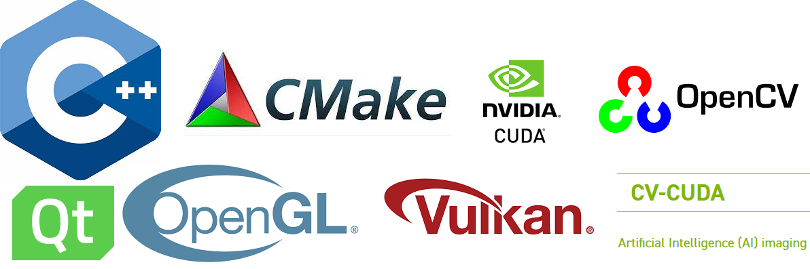

--------------------------------------------------------------------------------
## C/CPP-LanguageProject

### CUDA_CPlusPlus
- 使用 C/C++ 开发 CUDA 加速 Nvidia GPU 编程

### OpenCV-CPP
### OpenCV 2.x API OpenCV for C++
- OpenCV 学习例子 & CMake
- 数字图像处理
- 视频处理
- 机器学习 & 深度学习

### PrimerC-plus-plus_exercises
### 经典书籍PrimerC++练习答案
* src/chapter01 第一章全部习题以及相应的源代码
* src/chapter02 第二章全部习题以及相应的源代码
* src/chapter03 第三章全部习题以及相应的源代码
* src/chapter04 第四章全部习题以及相应的源代码
* src/chapter05 第五章全部习题以及相应的源代码
* src/chapter06 第六章全部习题以及相应的源代码
* src/chapter07 第七章全部习题以及相应的源代码

### Essential-C++
### 经典书籍 Essential C++练习答案
* chapter1 第一章全部习题以及源代码
* chapter2 第二章全部习题以及源代码
* chapter3 第三章全部习题以及源代码
* chapter4 第四章全部习题以及源代码
* chapter5 第五章全部习题以及源代码
* chapter6 第六章全部习题以及源代码
* chapter7 第七章全部习题以及源代码

### Student-Management-System
### 学生信息管理系统
* 版本1——mian.c源代码和exe执行程序、README.txt文件
* 版本2——mian.c源代码和exe执行程序、README.txt文件
* 版本3——mian.cp等整个项目的源代码和exe执行程序、README.txt文件

### Tetris-game
### 俄罗斯方块游戏
* main.c源代码
* exe可执行程序
* music.mp3音频文件
* README.txt文件

### Address-Book-System
### 通讯录系统
* Main.cpp 源代码
* CMakeList.txt 配置文件
* config.txt shell操作命令

### Staff-Management-System
### 职工管理系统
* Main.cpp 主程序源代码文件

## About Author

### 掌中星辰转日月，手心苍穹天外天。
&emsp;&emsp;&emsp;&emsp;&emsp;&emsp;&emsp;&emsp;&emsp;&emsp;&emsp;&emsp;&emsp;&emsp;&emsp;&emsp;&emsp;&emsp;&emsp;&emsp;&emsp;&emsp;——云主宰苍穹

### Stay Hungry, Stay Foolish.
&emsp;&emsp;&emsp;&emsp;&emsp;&emsp;&emsp;&emsp;&emsp;&emsp;&emsp;&emsp;&emsp;&emsp;&emsp;&emsp;&emsp;&emsp;——Steve Jobs

- QQ Mail：2694048168@qq.com
- QQ：2694048168
- Weibo：云主宰苍穹
- GitHub: https://github.com/2694048168/
- Gitee：https://gitee.com/weili_yzzcq/
- Blog：https://2694048168.github.io/
- Blog：https://weili_yzzcq.gitee.io/ 
- Blog：https://blog.csdn.net/weixin_46782218/

