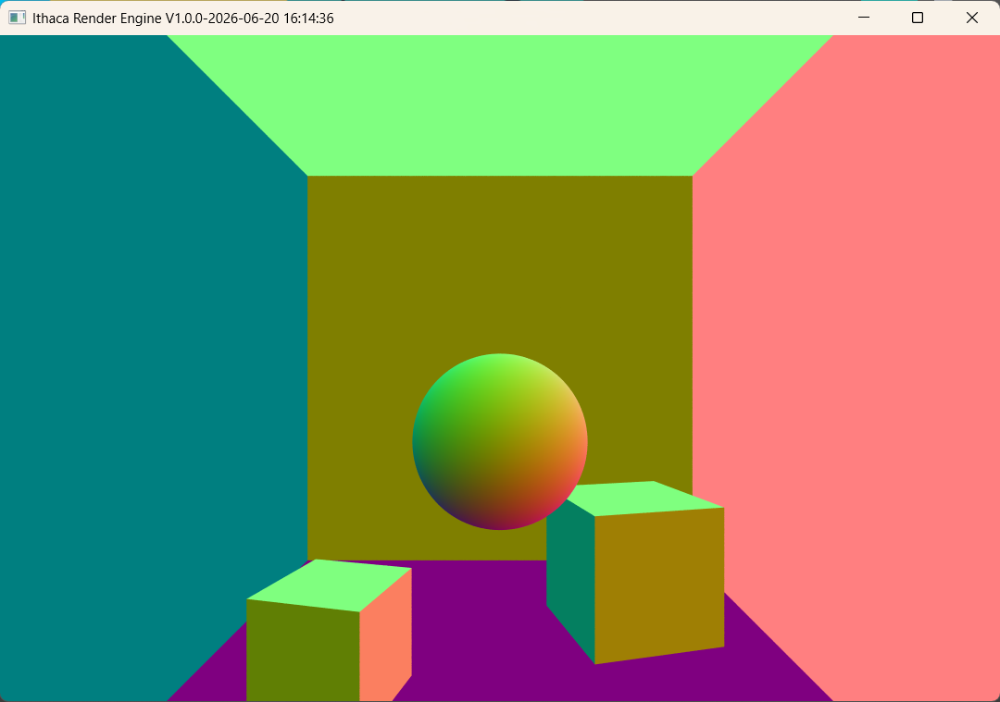

# Rendering for Computer Graphics from Scratch via Modern Cpp

<div align="center">
  <p><strong>Rendering for Computer Graphics from Scratch via Modern Cpp</strong></p>
  <p>
    
    
    
  </p>
</div>



## Quick Start

```bash
mkdir external
# 1. download GLM from https://github.com/g-truc/glm/releases/
# 2. upzip glm into external/glm 
# 3. download MiniFB from https://github.com/emoon/minifb/releases/
# 4. upzip minifb into external/minifb
# 5. using XML parser https://github.com/leethomason/tinyxml2

cmake --preset windows-debug          # 配置 Debug 构建目录
cmake --build --preset windows-debug  # 构建 Debug 版本

cmake --preset windows-release          # 配置 Release 构建目录
cmake --build --preset windows-release  # 构建 Release 版本
```

## Project Layout

```text
.
├── .gitignore
├── .clang-format
├── .clang-tidy
├── CMakeLists.txt
├── CMakePresets.json
├── README.md
└── example
└── external
└── src
    ├── common.hpp
    ├── logger.hpp
    └── Renderer.h
    └── Renderer.cpp
    └── main.cpp
```
