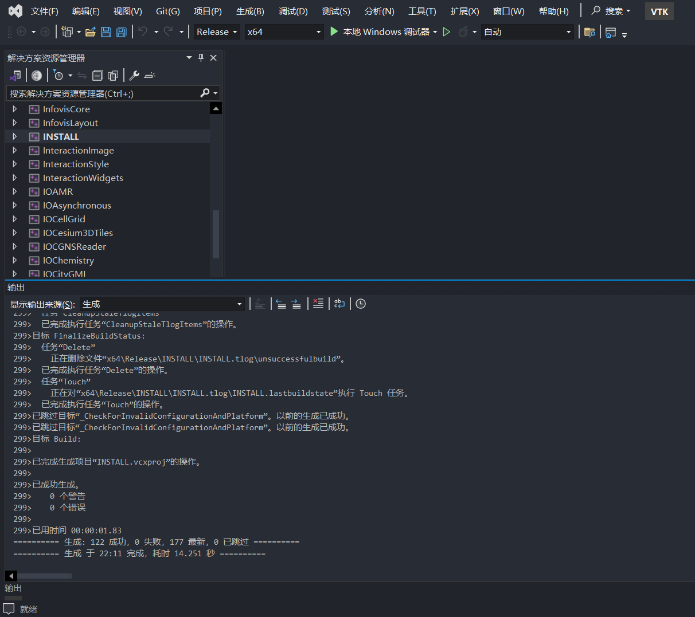

## VTK learning via Modern C++ and QT6

> Process images and create 3D computer graphics with the Visualization Toolkit. The Visualization Toolkit (VTK) is open source software for manipulating and displaying scientific data. It comes with state-of-the-art tools for 3D rendering, a suite of widgets for 3D interaction, and extensive 2D plotting capability.


### **Useful Linking**
- [VTK download](https://vtk.org/download/)
- [VTK example](https://examples.vtk.org/site/)
- [VTK reference](https://docs.vtk.org/en/latest/)
- [VTK book](https://gitlab.kitware.com/vtk/textbook/raw/master/VTKBook/VTKTextBook.pdf)

### **Quick Install & Configure**
1. download the QT online-installer and install the QT for platform(Windows/Linux)
2. download the source code and build-compile via CMake for platform(Windows/Linux)
3. cmake configure the VTK **enable QT**

```shell
cmake -S . -B build -G "Visual Studio 17 2022" -DCMAKE_BUILD_TYPE:STRING=Debug 
cmake -S . -B build -G "Visual Studio 17 2022" -DCMAKE_BUILD_TYPE:STRING=Release 

cmake --build build --config Debug
cmake --build build --config Release
```



### **Hello World Example**
- QT 采用 Debug和Release 需要匹配对应 VTK 库编译的也是 Debug和Release版本,否则报错 **报错 QWidget: Must construct a QApplication before a QWidget**
